# Capstone II Report — Figures & Diagrams

> **20 Mermaid diagrams** for the capstone report.
> Each figure has an **exact placement instruction** telling your friend where to insert it.
> Figures are numbered in the order they appear in the report (Chapter 4 → 5 → 6 → 7).

---

## How to Insert These Figures

1. Go to [mermaid.live](https://mermaid.live)
2. Paste each Mermaid code block
3. Click **Actions → Download PNG** (or SVG for higher quality)
4. Insert the image in the Word/LaTeX report at the location specified
5. Add the caption exactly as shown (IEEE style: "Figure X: Title")

---

## Table of Figures

| Fig # | Title | Place In | Place After |
|-------|-------|----------|-------------|
| 1 | High-Level System Architecture | §4.2 System Architecture (Final) | Replace the ASCII art box diagram on page ~8 |
| 2 | Alert Processing Pipeline | §4.3.1 Alert Processing Pipeline | After the `Algorithm: ProcessSecurityAlert` pseudocode block |
| 3 | Circuit Breaker State Machine | §4.3.2 Circuit Breaker State Machine | After the `States: CLOSED → OPEN → HALF_OPEN` text block |
| 4 | Technology Stack Layers | §4.5 Technology Stack | After the technology version table (Python, K3s, Falco…) |
| 5 | Project Timeline (Gantt) | §4.6 Work Breakdown Structure | After the WBS table (WP1–WP7) |
| 6 | LLM Multi-Provider Failover Chain | §5.2 Multi-LLM Integration | After the `LLMManager.analyze()` code block |
| 7 | Circuit Breaker Implementation Detail | §5.2 Multi-LLM Integration | After the `CircuitBreaker` Python code block |
| 8 | HITL Governance Modes | §5.3 Human-in-the-Loop Governance | After the `GovernanceController` code block |
| 9 | Kubernetes Cluster Topology | §5.4 Kubernetes Automation | After the `K8sAutomation.scale_deployment()` code block |
| 10 | Severity-Based Response Matrix | §5.4 Kubernetes Automation | Directly after Figure 9 (same section) |
| 11 | Alert Deduplication Funnel | §5.6 Alert Deduplication | After the `AlertCache` Python code block |
| 12 | Deduplication Decision Flowchart | §5.6 Alert Deduplication | Directly after Figure 11 (same section) |
| 13 | Attack Severity Distribution | §6.4 Attack Simulation Results | After the "Privilege Escalation Simulation" results table |
| 14 | MITRE ATT&CK for ICS Coverage | §6.4 Attack Simulation Results | Directly after Figure 13 (same section) |
| 15 | Before vs After: Manual vs AI-Driven | §6.5 Performance Metrics | After the "LLM Provider Performance" table |
| 16 | LLM Provider Comparison | §6.5 Performance Metrics | Directly after Figure 15 (same section) |
| 17 | Cluster Scalability & Resources | §6.5 Performance Metrics | After the "Deduplication Effectiveness" table |
| 18 | Capstone I vs II Achievement Comparison | §6.7 Comparison with Capstone I Targets | After the comparison table |
| 19 | IoT Integration Architecture | §5.1 Software Implementation Overview | After the "Core Module Summary" table |
| 20 | Key Contributions Map | §7.2 Key Contributions | After the contributions table |

---

## Chapter 4 Figures — Methodology & Design

---

### Figure 1 — High-Level System Architecture

> **PLACE IN:** Section 4.2 "System Architecture (Final)" (report line ~270)
> **PLACE AFTER:** Replace the entire ASCII-art box diagram that starts with `┌───────` and ends with `└───────`. Put this figure in its place.
> **CAPTION:** "Figure 1: High-level system architecture showing the five processing layers — IoT devices, detection engines, IDS core with LLM analysis, Kubernetes orchestration, and the operator dashboard."

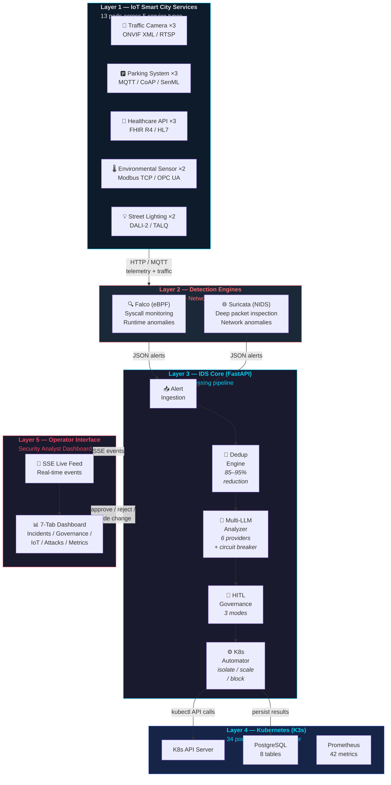
```mermaid
graph TB
    subgraph L1["<b>Layer 1 — IoT Smart City Services</b><br/>13 pods across 5 service types"]
        TC["🎥 Traffic Camera ×3<br/>ONVIF XML / RTSP"]
        PS["🅿️ Parking System ×3<br/>MQTT / CoAP / SenML"]
        HA["🏥 Healthcare API ×3<br/>FHIR R4 / HL7"]
        ES["🌡️ Environmental Sensor ×2<br/>Modbus TCP / OPC UA"]
        SL["💡 Street Lighting ×2<br/>DALI-2 / TALQ"]
    end

    subgraph L2["<b>Layer 2 — Detection Engines</b><br/>Runtime + Network monitoring"]
        FALCO["🔍 Falco (eBPF)<br/>Syscall monitoring<br/>Runtime anomalies"]
        SURI["🌐 Suricata (NIDS)<br/>Deep packet inspection<br/>Network anomalies"]
    end

    subgraph L3["<b>Layer 3 — IDS Core (FastAPI)</b><br/>Alert processing pipeline"]
        direction LR
        INGEST["📥 Alert<br/>Ingestion"] --> DEDUP["🔄 Dedup<br/>Engine<br/><i>85–95%<br/>reduction</i>"]
        DEDUP --> LLM["🧠 Multi-LLM<br/>Analyzer<br/><i>6 providers<br/>+ circuit breaker</i>"]
        LLM --> HITL["👤 HITL<br/>Governance<br/><i>3 modes</i>"]
        HITL --> K8SAUTO["⚙️ K8s<br/>Automator<br/><i>isolate / scale<br/>/ block</i>"]
    end

    subgraph L4["<b>Layer 4 — Kubernetes (K3s)</b><br/>34 pods, single-node cluster"]
        API["K8s API Server"]
        PG["PostgreSQL<br/>8 tables"]
        PROM["Prometheus<br/>42 metrics"]
    end

    subgraph L5["<b>Layer 5 — Operator Interface</b><br/>Security Analyst Dashboard"]
        DASH["📊 7-Tab Dashboard<br/>Incidents / Governance /<br/>IoT / Attacks / Metrics"]
        SSE["📡 SSE Live Feed<br/>Real-time events"]
    end

    L1 -->|"HTTP / MQTT<br/>telemetry + traffic"| L2
    FALCO -->|"JSON alerts"| INGEST
    SURI -->|"JSON alerts"| INGEST
    K8SAUTO -->|"kubectl API calls"| API
    K8SAUTO -->|"persist results"| PG
    L3 -->|"SSE events"| SSE
    SSE --> DASH
    DASH -->|"approve / reject /<br/>mode change"| L3

    style L1 fill:#0d1b2a,color:#e0e0e0,stroke:#00d4ff
    style L2 fill:#1b2838,color:#ff6b6b,stroke:#ff6b6b
    style L3 fill:#1a1a2e,color:#00d4ff,stroke:#00d4ff
    style L4 fill:#162447,color:#00d4ff,stroke:#1e40af
    style L5 fill:#1a1a2e,color:#e94560,stroke:#e94560
```

---

### Figure 2 — Alert Processing Pipeline (Sequence Diagram)

> **PLACE IN:** Section 4.3.1 "Alert Processing Pipeline" (report line ~340)
> **PLACE AFTER:** The pseudocode block that starts with `Algorithm: ProcessSecurityAlert(alert)` and ends with `RETURN success_response`. Place the figure right below that code block.
> **CAPTION:** "Figure 2: End-to-end alert processing sequence showing the flow from detection engines through deduplication, LLM analysis, governance checks, and automated Kubernetes response."

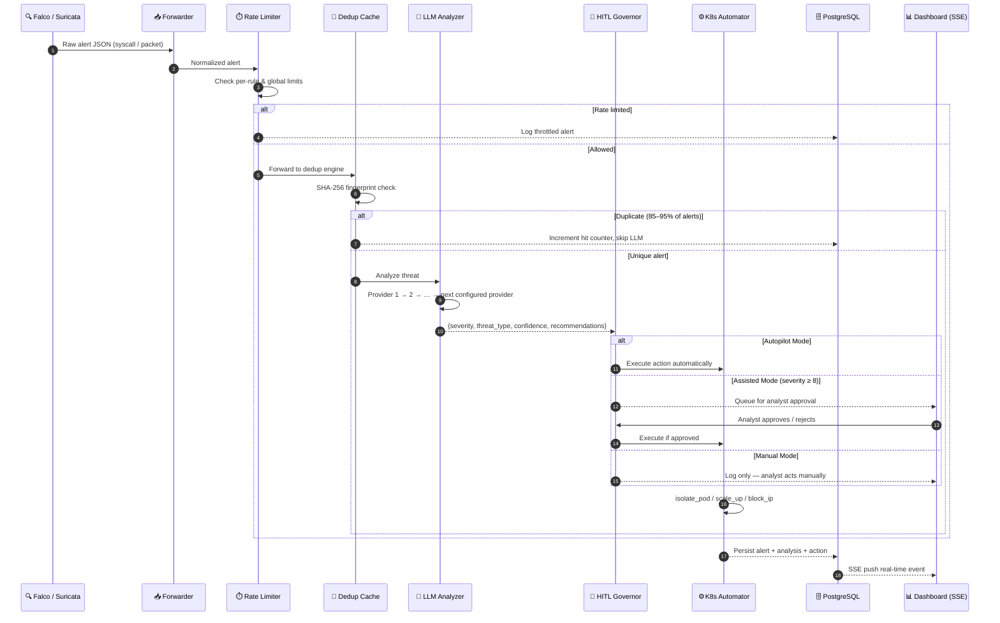
```mermaid
sequenceDiagram
    autonumber
    participant F as 🔍 Falco / Suricata
    participant FW as 📥 Forwarder
    participant RL as ⏱️ Rate Limiter
    participant DD as 🔄 Dedup Cache
    participant LLM as 🧠 LLM Analyzer
    participant GOV as 👤 HITL Governor
    participant K8S as ⚙️ K8s Automator
    participant DB as 🗄️ PostgreSQL
    participant UI as 📊 Dashboard (SSE)

    F->>FW: Raw alert JSON (syscall / packet)
    FW->>RL: Normalized alert
    RL->>RL: Check per-rule & global limits

    alt Rate limited
        RL-->>DB: Log throttled alert
    else Allowed
        RL->>DD: Forward to dedup engine
        DD->>DD: SHA-256 fingerprint check
        alt Duplicate (85–95% of alerts)
            DD-->>DB: Increment hit counter, skip LLM
        else Unique alert
            DD->>LLM: Analyze threat
            LLM->>LLM: Provider 1 → 2 → … → next configured provider
            LLM-->>GOV: {severity, threat_type, confidence, recommendations}

            alt Autopilot Mode
                GOV->>K8S: Execute action automatically
            else Assisted Mode (severity ≥ 8)
                GOV-->>UI: Queue for analyst approval
                UI->>GOV: Analyst approves / rejects
                GOV->>K8S: Execute if approved
            else Manual Mode
                GOV-->>UI: Log only — analyst acts manually
            end

            K8S->>K8S: isolate_pod / scale_up / block_ip
        end
    end

    K8S-->>DB: Persist alert + analysis + action
    DB-->>UI: SSE push real-time event
```

---

### Figure 3 — Circuit Breaker State Machine

> **PLACE IN:** Section 4.3.2 "Circuit Breaker State Machine" (report line ~406)
> **PLACE AFTER:** The text block that describes the three states (`CLOSED → OPEN → HALF_OPEN → CLOSED`). Place the figure right below that description.
> **CAPTION:** "Figure 3: Circuit breaker state machine for LLM provider health management. Each provider maintains an independent circuit breaker with a 5-failure threshold and 30-second cooldown period."

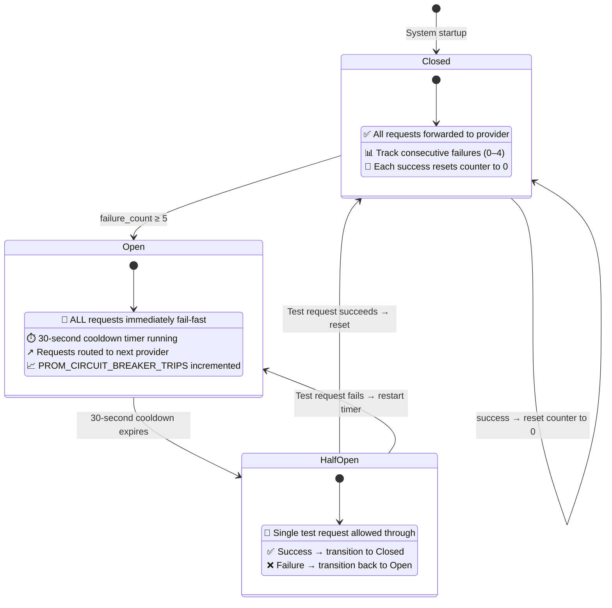
```mermaid
stateDiagram-v2
    [*] --> Closed : System startup

    Closed --> Open : failure_count ≥ 5
    Closed --> Closed : success → reset counter to 0

    Open --> HalfOpen : 30-second cooldown expires

    HalfOpen --> Closed : Test request succeeds → reset
    HalfOpen --> Open : Test request fails → restart timer

    state Closed {
        [*] --> NormalOps
        NormalOps : ✅ All requests forwarded to provider
        NormalOps : 📊 Track consecutive failures (0–4)
        NormalOps : 🔄 Each success resets counter to 0
    }

    state Open {
        [*] --> Blocked
        Blocked : 🚫 ALL requests immediately fail-fast
        Blocked : ⏱️ 30-second cooldown timer running
        Blocked : ↗️ Requests routed to next provider
        Blocked : 📈 PROM_CIRCUIT_BREAKER_TRIPS incremented
    }

    state HalfOpen {
        [*] --> Probing
        Probing : 🧪 Single test request allowed through
        Probing : ✅ Success → transition to Closed
        Probing : ❌ Failure → transition back to Open
    }
```

---

### Figure 4 — Technology Stack Layers

> **PLACE IN:** Section 4.5 "Technology Stack" (report line ~440)
> **PLACE AFTER:** The technology version table (Python 3.10+, K3s 1.28+, Falco 0.36+, etc.). Place the figure right below that table.
> **CAPTION:** "Figure 4: Eight-layer technology stack from hardware edge devices through the AI/LLM layer to the operator interface, showing the complete vertical integration of the system."

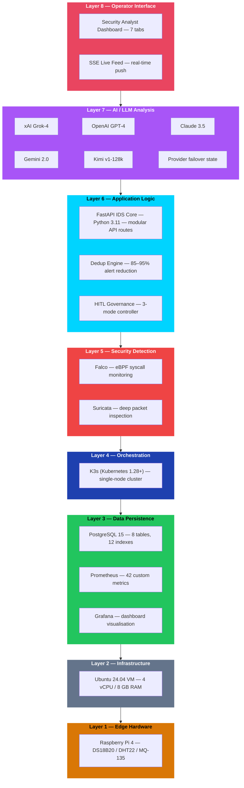
```mermaid
graph TB
    subgraph L8["<b>Layer 8 — Operator Interface</b>"]
        D1["Security Analyst Dashboard — 7 tabs"]
        D2["SSE Live Feed — real-time push"]
    end

    subgraph L7["<b>Layer 7 — AI / LLM Analysis</b>"]
        A1["xAI Grok-4"] ~~~ A2["OpenAI GPT-4"] ~~~ A3["Claude 3.5"]
        A4["Gemini 2.0"] ~~~ A5["Kimi v1-128k"] ~~~ A6["Provider failover state"]
    end

    subgraph L6["<b>Layer 6 — Application Logic</b>"]
        B1["FastAPI IDS Core — Python 3.11 — modular API routes"]
        B2["Dedup Engine — 85–95% alert reduction"]
        B3["HITL Governance — 3-mode controller"]
    end

    subgraph L5["<b>Layer 5 — Security Detection</b>"]
        C1["Falco — eBPF syscall monitoring"]
        C2["Suricata — deep packet inspection"]
    end

    subgraph L4["<b>Layer 4 — Orchestration</b>"]
        E1["K3s (Kubernetes 1.28+) — single-node cluster"]
    end

    subgraph L3["<b>Layer 3 — Data Persistence</b>"]
        F1["PostgreSQL 15 — 8 tables, 12 indexes"]
        F2["Prometheus — 42 custom metrics"]
        F3["Grafana — dashboard visualisation"]
    end

    subgraph L2["<b>Layer 2 — Infrastructure</b>"]
        G1["Ubuntu 24.04 VM — 4 vCPU / 8 GB RAM"]
    end

    subgraph L1["<b>Layer 1 — Edge Hardware</b>"]
        H1["Raspberry Pi 4 — DS18B20 / DHT22 / MQ-135"]
    end

    L8 --> L7 --> L6 --> L5 --> L4 --> L3 --> L2 --> L1

    style L8 fill:#e94560,color:#fff,stroke:#e94560
    style L7 fill:#a855f7,color:#fff,stroke:#a855f7
    style L6 fill:#00d4ff,color:#000,stroke:#00d4ff
    style L5 fill:#ef4444,color:#fff,stroke:#ef4444
    style L4 fill:#1e40af,color:#fff,stroke:#1e40af
    style L3 fill:#22c55e,color:#000,stroke:#22c55e
    style L2 fill:#64748b,color:#fff,stroke:#64748b
    style L1 fill:#d97706,color:#000,stroke:#d97706
```

---

### Figure 5 — Project Timeline (Gantt Chart)

> **PLACE IN:** Section 4.6 "Work Breakdown Structure (Capstone II)" (report line ~454)
> **PLACE AFTER:** The WBS table showing WP1 through WP7 with their durations and status. Place the figure right below that table.
> **CAPTION:** "Figure 5: Gantt chart showing the Capstone II development timeline from January to June 2025, organised into five phases: Research, Core Platform, AI Integration, IoT & Attacks, and Polish."

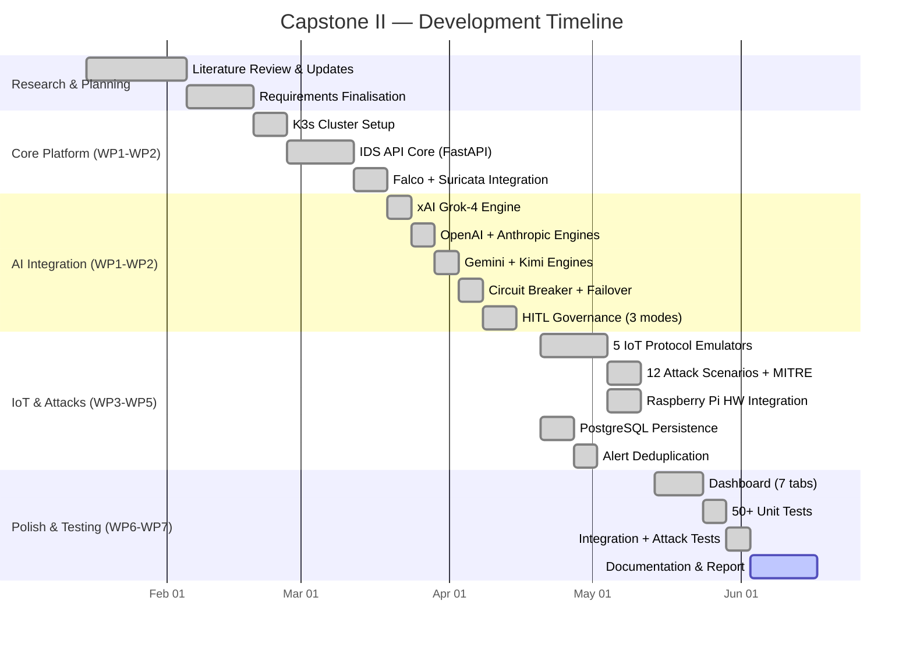
```mermaid
gantt
    title Capstone II — Development Timeline
    dateFormat  YYYY-MM-DD
    axisFormat  %b %d

    section Research & Planning
    Literature Review & Updates     :done, r1, 2025-01-15, 21d
    Requirements Finalisation       :done, r2, after r1, 14d

    section Core Platform (WP1-WP2)
    K3s Cluster Setup               :done, c1, 2025-02-19, 7d
    IDS API Core (FastAPI)          :done, c2, after c1, 14d
    Falco + Suricata Integration    :done, c3, after c2, 7d

    section AI Integration (WP1-WP2)
    xAI Grok-4 Engine               :done, a1, 2025-03-19, 5d
    OpenAI + Anthropic Engines      :done, a2, after a1, 5d
    Gemini + Kimi Engines           :done, a3, after a2, 5d
    Circuit Breaker + Failover      :done, a4, after a3, 5d
    HITL Governance (3 modes)       :done, a5, after a4, 7d

    section IoT & Attacks (WP3-WP5)
    5 IoT Protocol Emulators        :done, i1, 2025-04-20, 14d
    12 Attack Scenarios + MITRE     :done, i2, after i1, 7d
    Raspberry Pi HW Integration     :done, i3, after i1, 7d
    PostgreSQL Persistence          :done, i4, 2025-04-20, 7d
    Alert Deduplication             :done, i5, after i4, 5d

    section Polish & Testing (WP6-WP7)
    Dashboard (7 tabs)              :done, p1, 2025-05-14, 10d
    50+ Unit Tests                  :done, p2, after p1, 5d
    Integration + Attack Tests      :done, p3, after p2, 5d
    Documentation & Report          :active, p4, after p3, 14d
```

---

## Chapter 5 Figures — Implementation

---

### Figure 19 — IoT Integration Architecture

> **PLACE IN:** Section 5.1 "Software Implementation Overview" (report line ~493)
> **PLACE AFTER:** The "Core Module Summary" table (the table showing main.py 2,162 lines, database.py 894 lines, etc.). Place the figure right below that table.
> **CAPTION:** "Figure 19: Three IoT device integration paths — physical Raspberry Pi hardware, Kubernetes-hosted protocol emulators, and the attack simulation console — all converging on the IDS API alert pipeline."

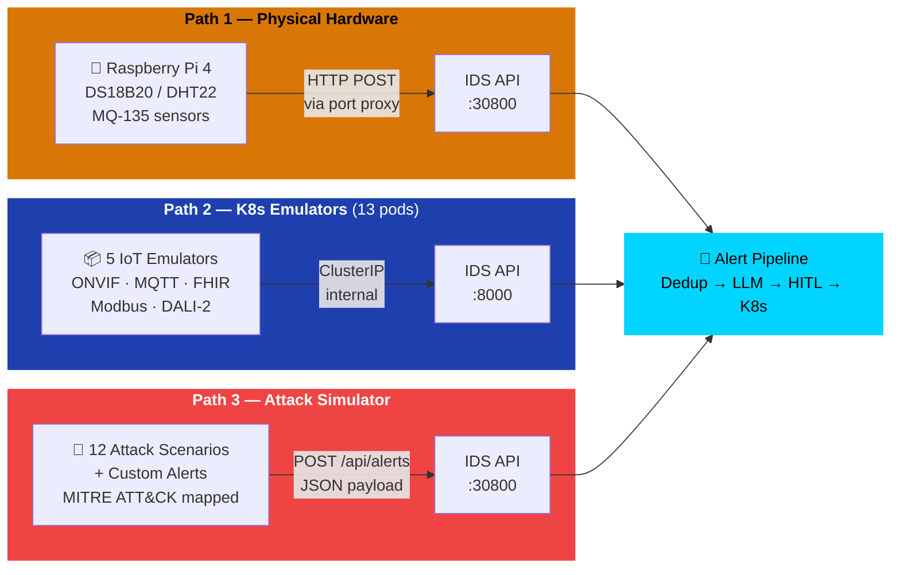
```mermaid
graph LR
    subgraph HW["<b>Path 1 — Physical Hardware</b>"]
        RPI["🔧 Raspberry Pi 4<br/>DS18B20 / DHT22<br/>MQ-135 sensors"] -->|"HTTP POST<br/>via port proxy"| IDS1["IDS API<br/>:30800"]
    end

    subgraph K8S["<b>Path 2 — K8s Emulators</b> (13 pods)"]
        EMU["📦 5 IoT Emulators<br/>ONVIF · MQTT · FHIR<br/>Modbus · DALI-2"] -->|"ClusterIP<br/>internal"| IDS2["IDS API<br/>:8000"]
    end

    subgraph ATK["<b>Path 3 — Attack Simulator</b>"]
        SIM["🎯 12 Attack Scenarios<br/>+ Custom Alerts<br/>MITRE ATT&CK mapped"] -->|"POST /api/alerts<br/>JSON payload"| IDS3["IDS API<br/>:30800"]
    end

    IDS1 --> PIPE["🔄 Alert Pipeline<br/>Dedup → LLM → HITL → K8s"]
    IDS2 --> PIPE
    IDS3 --> PIPE

    style HW fill:#d97706,color:#000,stroke:#d97706
    style K8S fill:#1e40af,color:#fff,stroke:#1e40af
    style ATK fill:#ef4444,color:#fff,stroke:#ef4444
    style PIPE fill:#00d4ff,color:#000,stroke:#00d4ff
```

---

### Figure 6 — LLM Multi-Provider Failover Chain

> **PLACE IN:** Section 5.2 "Multi-LLM Integration" (report line ~512)
> **PLACE AFTER:** The `LLMManager.analyze()` Python code block (the one with `async def analyze(self, alert: dict)`). Place the figure right below that code.
> **CAPTION:** "Figure 6: Priority-based LLM failover chain. Alerts are routed through providers in priority order; each provider has an independent circuit breaker."

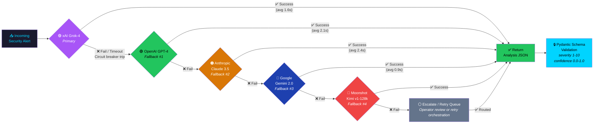
```mermaid
graph LR
    ALERT["📥 Incoming<br/>Security Alert"] --> CB1{"🟣 xAI Grok-4<br/><i>Primary</i>"}
    CB1 -->|"✅ Success<br/>(avg 1.6s)"| RESULT["✅ Return<br/>Analysis JSON"]
    CB1 -->|"❌ Fail / Timeout<br/>Circuit breaker trip"| CB2{"🟢 OpenAI GPT-4<br/><i>Fallback #1</i>"}
    CB2 -->|"✅ Success<br/>(avg 2.1s)"| RESULT
    CB2 -->|"❌ Fail"| CB3{"🟠 Anthropic<br/>Claude 3.5<br/><i>Fallback #2</i>"}
    CB3 -->|"✅ Success<br/>(avg 2.4s)"| RESULT
    CB3 -->|"❌ Fail"| CB4{"🔵 Google<br/>Gemini 2.0<br/><i>Fallback #3</i>"}
    CB4 -->|"✅ Success<br/>(avg 0.9s)"| RESULT
    CB4 -->|"❌ Fail"| CB5{"🔴 Moonshot<br/>Kimi v1-128k<br/><i>Fallback #4</i>"}
    CB5 -->|"✅ Success"| RESULT
    CB5 -->|"❌ Fail"| CB6["⚪ Escalate / Retry Queue<br/><i>Operator review or retry orchestration</i>"]
    CB6 -->|"✅ Routed"| RESULT

    RESULT --> VALIDATE["🔒 Pydantic Schema<br/>Validation<br/><i>severity 1-10<br/>confidence 0.0-1.0</i>"]

    style ALERT fill:#1a1a2e,color:#00d4ff
    style CB1 fill:#a855f7,color:#fff
    style CB2 fill:#22c55e,color:#000
    style CB3 fill:#d97706,color:#fff
    style CB4 fill:#1e40af,color:#fff
    style CB5 fill:#ef4444,color:#fff
    style CB6 fill:#64748b,color:#fff
    style RESULT fill:#22c55e,color:#000
    style VALIDATE fill:#00d4ff,color:#000
```

---

### Figure 7 — Circuit Breaker Implementation Detail

> **PLACE IN:** Section 5.2 "Multi-LLM Integration" (report line ~580)
> **PLACE AFTER:** The `CircuitBreaker` Python class code block (the one with `class CircuitBreaker`, `record_failure`, `record_success`, `is_closed`). Place the figure right below that code.
> **CAPTION:** "Figure 7: Per-provider circuit breaker state transitions with threshold and timing parameters. Each of the 6 LLM providers maintains an independent circuit breaker instance."

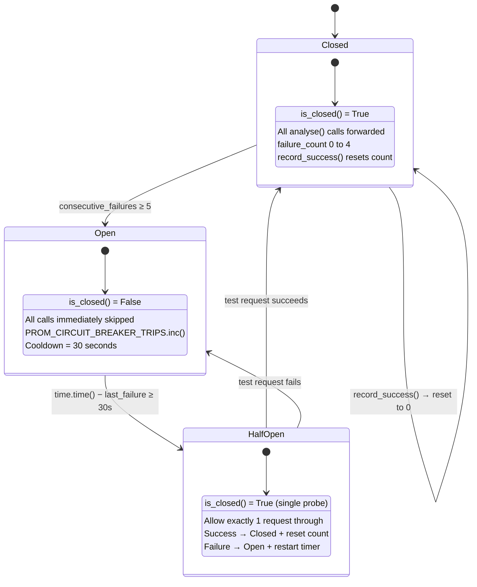
```mermaid
stateDiagram-v2
    [*] --> Closed

    Closed --> Open : consecutive_failures ≥ 5
    Closed --> Closed : record_success() → reset to 0

    Open --> HalfOpen : time.time() − last_failure ≥ 30s

    HalfOpen --> Closed : test request succeeds
    HalfOpen --> Open : test request fails

    state Closed {
        [*] --> Healthy
        Healthy : is_closed() = True
        Healthy : All analyse() calls forwarded
        Healthy : failure_count 0 to 4
        Healthy : record_success() resets count
    }

    state Open {
        [*] --> CircuitOpen
        CircuitOpen : is_closed() = False
        CircuitOpen : All calls immediately skipped
        CircuitOpen : PROM_CIRCUIT_BREAKER_TRIPS.inc()
        CircuitOpen : Cooldown = 30 seconds
    }

    state HalfOpen {
        [*] --> TestRequest
        TestRequest : is_closed() = True (single probe)
        TestRequest : Allow exactly 1 request through
        TestRequest : Success → Closed + reset count
        TestRequest : Failure → Open + restart timer
    }
```

---

### Figure 8 — HITL Governance Modes State Machine

> **PLACE IN:** Section 5.3 "Human-in-the-Loop Governance" (report line ~600)
> **PLACE AFTER:** The `GovernanceController` Python code block (the one with `should_execute()`, `queue_for_approval()`, `approve_action()`). Place the figure right below that code.
> **CAPTION:** "Figure 8: Human-in-the-Loop governance state machine showing the three automation modes and their decision logic. Operators can switch modes at any time via the dashboard."

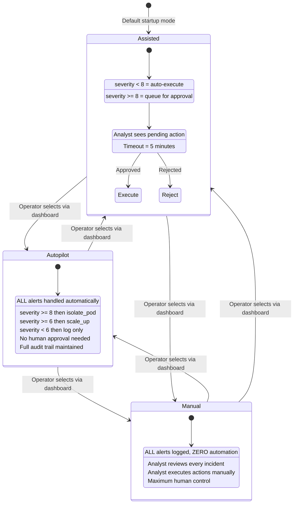
```mermaid
stateDiagram-v2
    [*] --> Assisted : Default startup mode

    Autopilot --> Assisted : Operator selects via dashboard
    Autopilot --> Manual : Operator selects via dashboard

    Assisted --> Autopilot : Operator selects via dashboard
    Assisted --> Manual : Operator selects via dashboard

    Manual --> Autopilot : Operator selects via dashboard
    Manual --> Assisted : Operator selects via dashboard

    state Autopilot {
        [*] --> AutoDecision
        AutoDecision : ALL alerts handled automatically
        AutoDecision : severity >= 8 then isolate_pod
        AutoDecision : severity >= 6 then scale_up
        AutoDecision : severity < 6 then log only
        AutoDecision : No human approval needed
        AutoDecision : Full audit trail maintained
    }

    state Assisted {
        [*] --> AssistedDecision
        AssistedDecision : severity < 8 = auto-execute
        AssistedDecision : severity >= 8 = queue for approval
        AssistedDecision --> WaitApproval
        WaitApproval : Analyst sees pending action
        WaitApproval : Timeout = 5 minutes
        WaitApproval --> Execute : Approved
        WaitApproval --> Reject : Rejected
    }

    state Manual {
        [*] --> ManualOps
        ManualOps : ALL alerts logged, ZERO automation
        ManualOps : Analyst reviews every incident
        ManualOps : Analyst executes actions manually
        ManualOps : Maximum human control
    }
```

---

### Figure 9 — Kubernetes Cluster Topology

> **PLACE IN:** Section 5.4 "Kubernetes Automation" (report line ~657)
> **PLACE AFTER:** The `K8sAutomation.scale_deployment()` code block. Place the figure right below that code.
> **CAPTION:** "Figure 9: Kubernetes cluster topology showing all 34 pods across the smart-city namespace and system namespaces. The IDS API receives alerts from Falco and Suricata forwarders and monitors all IoT service pods."

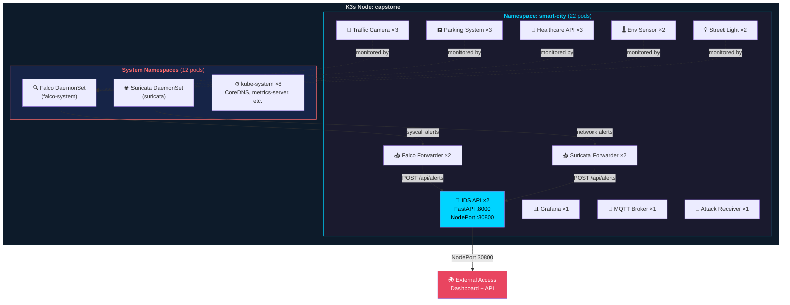
```mermaid
graph TB
    subgraph Node["<b>K3s Node: capstone</b><br/>Ubuntu 24.04 · 4 vCPU · 8 GB RAM"]
        subgraph NS["<b>Namespace: smart-city</b> (22 pods)"]
            IDS["🧠 IDS API ×2<br/>FastAPI :8000<br/>NodePort :30800"]
            TC["🎥 Traffic Camera ×3"]
            PS["🅿️ Parking System ×3"]
            HC["🏥 Healthcare API ×3"]
            ENV["🌡️ Env Sensor ×2"]
            SL["💡 Street Light ×2"]
            FW["📥 Falco Forwarder ×2"]
            SW["📥 Suricata Forwarder ×2"]
            GF["📊 Grafana ×1"]
            MQTT["📡 MQTT Broker ×1"]
            AR["🎯 Attack Receiver ×1"]
        end
        subgraph SYS["<b>System Namespaces</b> (12 pods)"]
            FALCO["🔍 Falco DaemonSet<br/>(falco-system)"]
            SURI["🌐 Suricata DaemonSet<br/>(suricata)"]
            KUBE["⚙️ kube-system ×8<br/>CoreDNS, metrics-server, etc."]
        end
    end

    IDS -->|"NodePort 30800"| EXT["🌍 External Access<br/>Dashboard + API"]
    FALCO -->|"syscall alerts"| FW -->|"POST /api/alerts"| IDS
    SURI -->|"network alerts"| SW -->|"POST /api/alerts"| IDS
    TC & PS & HC & ENV & SL -.->|"monitored by"| FALCO

    style Node fill:#0d1b2a,color:#e0e0e0,stroke:#00d4ff
    style NS fill:#1a1a2e,color:#00d4ff,stroke:#00d4ff
    style SYS fill:#162447,color:#ff6b6b,stroke:#ff6b6b
    style IDS fill:#00d4ff,color:#000
    style EXT fill:#e94560,color:#fff
```

---

### Figure 10 — Severity-Based Automated Response Matrix

> **PLACE IN:** Section 5.4 "Kubernetes Automation" (report line ~690)
> **PLACE AFTER:** Figure 9 (same section). This explains the threshold-based decision logic that the `K8sAutomation` module follows.
> **CAPTION:** "Figure 10: Automated response actions mapped to LLM severity scores. Higher severity triggers more aggressive defensive actions, from logging to full pod isolation with forensic evidence collection."

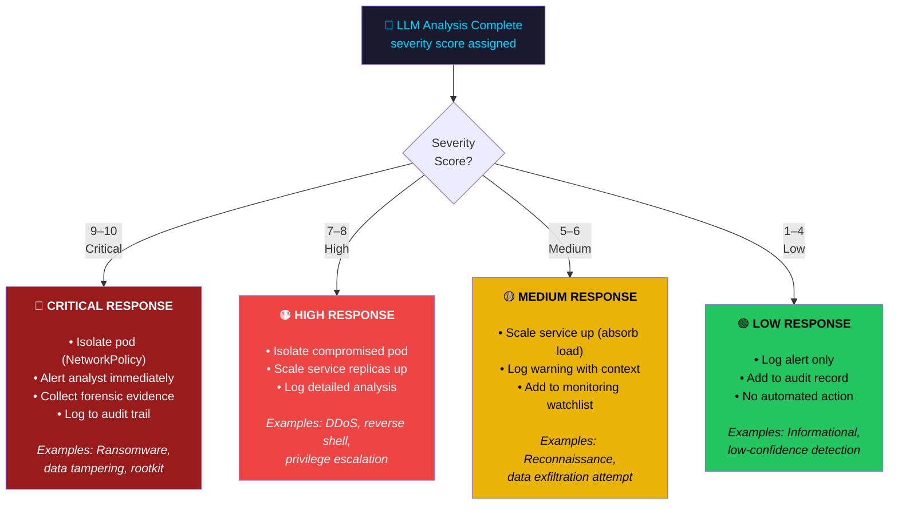
```mermaid
graph TB
    ALERT["🧠 LLM Analysis Complete<br/>severity score assigned"] --> CHECK{"Severity<br/>Score?"}

    CHECK -->|"9–10<br/>Critical"| S10["🔴 <b>CRITICAL RESPONSE</b><br/><br/>• Isolate pod (NetworkPolicy)<br/>• Alert analyst immediately<br/>• Collect forensic evidence<br/>• Log to audit trail<br/><br/><i>Examples: Ransomware,<br/>data tampering, rootkit</i>"]

    CHECK -->|"7–8<br/>High"| S8["🟠 <b>HIGH RESPONSE</b><br/><br/>• Isolate compromised pod<br/>• Scale service replicas up<br/>• Log detailed analysis<br/><br/><i>Examples: DDoS, reverse shell,<br/>privilege escalation</i>"]

    CHECK -->|"5–6<br/>Medium"| S6["🟡 <b>MEDIUM RESPONSE</b><br/><br/>• Scale service up (absorb load)<br/>• Log warning with context<br/>• Add to monitoring watchlist<br/><br/><i>Examples: Reconnaissance,<br/>data exfiltration attempt</i>"]

    CHECK -->|"1–4<br/>Low"| S4["🟢 <b>LOW RESPONSE</b><br/><br/>• Log alert only<br/>• Add to audit record<br/>• No automated action<br/><br/><i>Examples: Informational,<br/>low-confidence detection</i>"]

    style ALERT fill:#1a1a2e,color:#00d4ff
    style S10 fill:#991b1b,color:#fff
    style S8 fill:#ef4444,color:#fff
    style S6 fill:#eab308,color:#000
    style S4 fill:#22c55e,color:#000
```

---

### Figure 11 — Alert Deduplication Funnel

> **PLACE IN:** Section 5.6 "Alert Deduplication" (report line ~785)
> **PLACE AFTER:** The `AlertCache` Python class code block (the one with `_fingerprint()`, `get()`, `put()`). Place the figure right below that code.
> **CAPTION:** "Figure 11: Alert volume reduction funnel showing how raw alert volume (~10,000/hour) is progressively filtered through three deduplication stages before reaching the LLM analyzer, resulting in 85–95% reduction and 40–60% API cost savings."

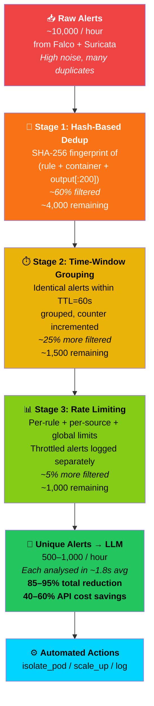
```mermaid
graph TB
    A["📥 <b>Raw Alerts</b><br/>~10,000 / hour<br/>from Falco + Suricata<br/><i>High noise, many duplicates</i>"] --> B

    B["🔑 <b>Stage 1: Hash-Based Dedup</b><br/>SHA-256 fingerprint of<br/>(rule + container + output[:200])<br/><i>~60% filtered</i><br/>~4,000 remaining"] --> C

    C["⏱️ <b>Stage 2: Time-Window Grouping</b><br/>Identical alerts within TTL=60s<br/>grouped, counter incremented<br/><i>~25% more filtered</i><br/>~1,500 remaining"] --> D

    D["📊 <b>Stage 3: Rate Limiting</b><br/>Per-rule + per-source + global limits<br/>Throttled alerts logged separately<br/><i>~5% more filtered</i><br/>~1,000 remaining"] --> E

    E["🧠 <b>Unique Alerts → LLM</b><br/>500–1,000 / hour<br/><i>Each analysed in ~1.8s avg</i><br/><b>85–95% total reduction</b><br/><b>40–60% API cost savings</b>"] --> F

    F["⚙️ <b>Automated Actions</b><br/>isolate_pod / scale_up / log"]

    style A fill:#ef4444,color:#fff
    style B fill:#f97316,color:#fff
    style C fill:#eab308,color:#000
    style D fill:#84cc16,color:#000
    style E fill:#22c55e,color:#000
    style F fill:#00d4ff,color:#000
```

---

### Figure 12 — Deduplication Decision Flowchart

> **PLACE IN:** Section 5.6 "Alert Deduplication" (report line ~830)
> **PLACE AFTER:** Figure 11 (same section). This shows the algorithmic decision logic inside the dedup engine.
> **CAPTION:** "Figure 12: Deduplication decision flowchart showing the three-stage filtering process. Each incoming alert is fingerprinted, checked against the LRU cache, evaluated for time-window similarity, and finally rate-limit checked before forwarding to the LLM."

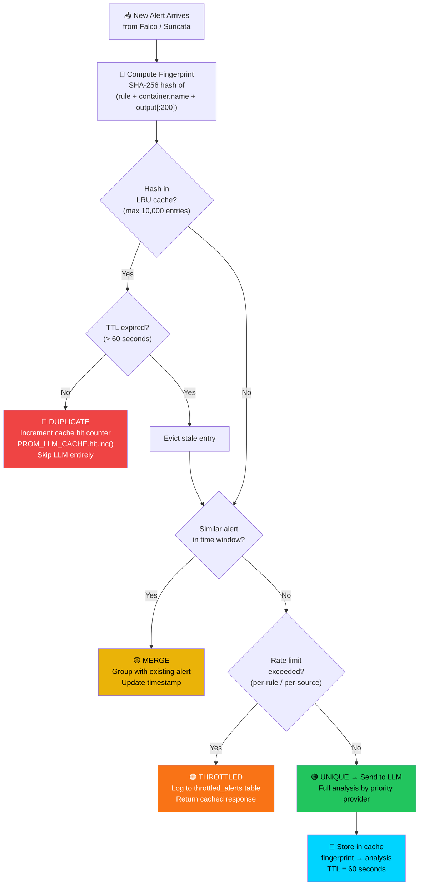
```mermaid
graph TD
    START["📥 New Alert Arrives<br/>from Falco / Suricata"] --> FINGER["🔑 Compute Fingerprint<br/>SHA-256 hash of<br/>(rule + container.name + output[:200])"]
    FINGER --> CACHE{"Hash in<br/>LRU cache?<br/>(max 10,000 entries)"}
    CACHE -->|"Yes"| EXPIRED{"TTL expired?<br/>(> 60 seconds)"}
    EXPIRED -->|"No"| DUP["🔴 DUPLICATE<br/>Increment cache hit counter<br/>PROM_LLM_CACHE.hit.inc()<br/>Skip LLM entirely"]
    EXPIRED -->|"Yes"| EVICT["Evict stale entry"] --> WINDOW
    CACHE -->|"No"| WINDOW{"Similar alert<br/>in time window?"}
    WINDOW -->|"Yes"| MERGE["🟡 MERGE<br/>Group with existing alert<br/>Update timestamp"]
    WINDOW -->|"No"| RATE{"Rate limit<br/>exceeded?<br/>(per-rule / per-source)"}
    RATE -->|"Yes"| THROTTLE["🟠 THROTTLED<br/>Log to throttled_alerts table<br/>Return cached response"]
    RATE -->|"No"| LLM["🟢 UNIQUE → Send to LLM<br/>Full analysis by priority provider"]
    LLM --> STORE["💾 Store in cache<br/>fingerprint → analysis<br/>TTL = 60 seconds"]

    style DUP fill:#ef4444,color:#fff
    style MERGE fill:#eab308,color:#000
    style THROTTLE fill:#f97316,color:#fff
    style LLM fill:#22c55e,color:#000
    style STORE fill:#00d4ff,color:#000
```

---

## Chapter 6 Figures — Testing & Results

---

### Figure 13 — Attack Scenario Severity Distribution

> **PLACE IN:** Section 6.4 "Attack Simulation Results" (report line ~964)
> **PLACE AFTER:** The "Privilege Escalation Simulation" results table (the one showing Detection time 0.3s, Severity score 9, etc.). Place the figure right below.
> **CAPTION:** "Figure 13: Distribution of the 12 predefined attack scenarios by severity level, showing a realistic mix weighted towards high-severity threats to test the system's automated response capabilities."

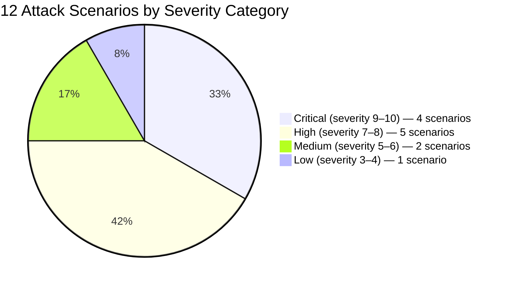
```mermaid
pie title 12 Attack Scenarios by Severity Category
    "Critical (severity 9–10) — 4 scenarios" : 4
    "High (severity 7–8) — 5 scenarios" : 5
    "Medium (severity 5–6) — 2 scenarios" : 2
    "Low (severity 3–4) — 1 scenario" : 1
```

---

### Figure 14 — MITRE ATT&CK for ICS Technique Coverage

> **PLACE IN:** Section 6.4 "Attack Simulation Results" (report line ~990)
> **PLACE AFTER:** Figure 13 (same section). This shows the breadth of attack technique coverage.
> **CAPTION:** "Figure 14: MITRE ATT&CK for ICS technique coverage map. The 12 attack scenarios cover 9 tactical categories and 12 unique technique IDs, demonstrating comprehensive coverage of the ICS threat landscape."


```mermaid
graph TB
    subgraph MITRE["<b>MITRE ATT&CK for ICS — 12 Techniques Covered</b>"]
        direction TB

        IA["<b>Initial Access</b>"] --- T866["T0866<br/>Exploitation of<br/>Remote Services"]

        EX["<b>Execution</b>"] --- T807["T0807<br/>Command-Line<br/>Interface"]

        DIS["<b>Discovery</b>"] --- T846["T0846<br/>Remote System<br/>Discovery"]

        LM["<b>Lateral Movement</b>"] --- T867["T0867<br/>Lateral Tool<br/>Transfer"]

        COL["<b>Collection</b>"] --- T859["T0859<br/>Valid Accounts"]

        EVA["<b>Evasion</b>"] --- T856["T0856<br/>Spoof Reporting<br/>Message"]

        IMP["<b>Impair Process</b>"] --- T836["T0836<br/>Modify Parameter"]
        IMP --- T855["T0855<br/>Unauthorized<br/>Command Message"]

        IMPACT["<b>Impact</b>"] --- T831["T0831<br/>Manipulation<br/>of Control"]
        IMPACT --- T830["T0830<br/>Man in the<br/>Middle"]
        IMPACT --- T828["T0828<br/>Loss of<br/>Productivity"]

        EXFIL["<b>Exfiltration</b>"] --- T882["T0882<br/>Theft of<br/>Operational Info"]
    end

    style IA fill:#ef4444,color:#fff
    style EX fill:#f97316,color:#fff
    style DIS fill:#eab308,color:#000
    style LM fill:#a855f7,color:#fff
    style COL fill:#d97706,color:#000
    style EVA fill:#6366f1,color:#fff
    style IMP fill:#ec4899,color:#fff
    style IMPACT fill:#991b1b,color:#fff
    style EXFIL fill:#00d4ff,color:#000
```

---

### Figure 15 — Before vs After: Manual vs AI-Driven Response

> **PLACE IN:** Section 6.5 "Performance Metrics" (report line ~1010)
> **PLACE AFTER:** The "LLM Provider Performance" table (the one showing xAI 1.6s/98.5%, OpenAI 2.1s/99.2%, etc.). Place the figure right below.
> **CAPTION:** "Figure 15: Comparison of manual security monitoring workflow versus the AI-driven IDS pipeline, demonstrating a 180× improvement in mean response time (15 minutes → <5 seconds) and elimination of repetitive manual triage."

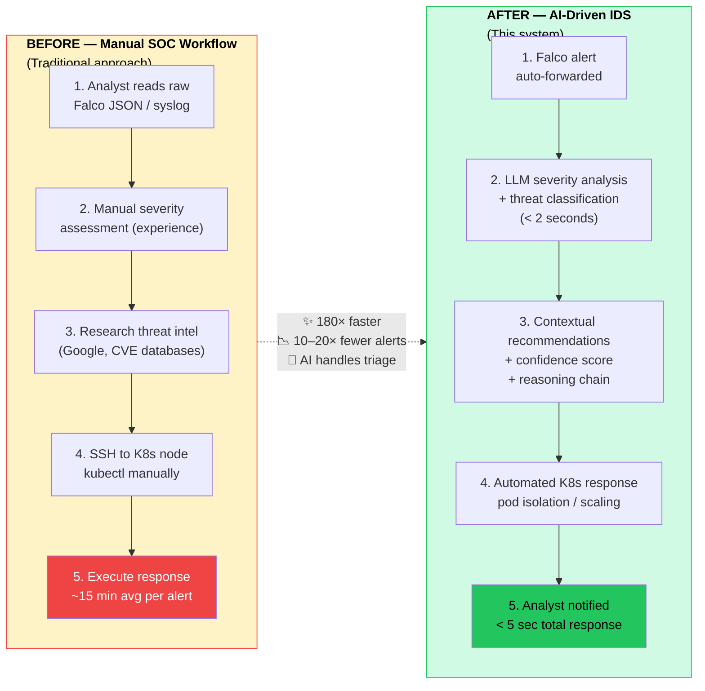
```mermaid
graph LR
    subgraph Before["<b>BEFORE — Manual SOC Workflow</b><br/>(Traditional approach)"]
        direction TB
        B1["1. Analyst reads raw<br/>Falco JSON / syslog"] --> B2["2. Manual severity<br/>assessment (experience)"]
        B2 --> B3["3. Research threat intel<br/>(Google, CVE databases)"]
        B3 --> B4["4. SSH to K8s node<br/>kubectl manually"]
        B4 --> B5["5. Execute response<br/>~15 min avg per alert"]
    end

    subgraph After["<b>AFTER — AI-Driven IDS</b><br/>(This system)"]
        direction TB
        A1["1. Falco alert<br/>auto-forwarded"] --> A2["2. LLM severity analysis<br/>+ threat classification<br/>(< 2 seconds)"]
        A2 --> A3["3. Contextual recommendations<br/>+ confidence score<br/>+ reasoning chain"]
        A3 --> A4["4. Automated K8s response<br/>pod isolation / scaling"]
        A4 --> A5["5. Analyst notified<br/>< 5 sec total response"]
    end

    Before -.->|"✨ 180× faster\n📉 10–20× fewer alerts\n🧠 AI handles triage"| After

    style B5 fill:#ef4444,color:#fff
    style A5 fill:#22c55e,color:#000
    style Before fill:#fef3c7,color:#000,stroke:#ef4444
    style After fill:#d1fae5,color:#000,stroke:#22c55e
```

---

### Figure 16 — LLM Provider Performance Comparison

> **PLACE IN:** Section 6.5 "Performance Metrics" (report line ~1015)
> **PLACE AFTER:** Figure 15 (same section). Provides a visual comparison of the provider metrics from the table above.
> **CAPTION:** "Figure 16: LLM provider performance comparison showing average latency, success rate, and circuit breaker trips across the five cloud providers during the 7-day test period."

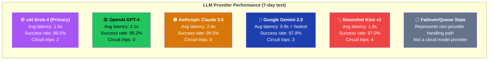
```mermaid
graph LR
    subgraph Providers["<b>LLM Provider Performance (7-day test)</b>"]
        direction TB

        P1["🟣 <b>xAI Grok-4 (Primary)</b><br/>Avg latency: 1.6s<br/>Success rate: 98.5%<br/>Circuit trips: 2"]

        P2["🟢 <b>OpenAI GPT-4</b><br/>Avg latency: 2.1s<br/>Success rate: 99.2%<br/>Circuit trips: 0"]

        P3["🟠 <b>Anthropic Claude 3.5</b><br/>Avg latency: 2.4s<br/>Success rate: 99.5%<br/>Circuit trips: 0"]

        P4["🔵 <b>Google Gemini 2.0</b><br/>Avg latency: 0.9s ⚡ fastest<br/>Success rate: 97.8%<br/>Circuit trips: 3"]

        P5["🔴 <b>Moonshot Kimi v1</b><br/>Avg latency: 1.8s<br/>Success rate: 97.0%<br/>Circuit trips: 4"]

        P6["⚪ <b>Failover/Queue State</b><br/>Represents non-provider handling path<br/>Not a cloud model provider"]
    end

    style P1 fill:#a855f7,color:#fff
    style P2 fill:#22c55e,color:#000
    style P3 fill:#d97706,color:#fff
    style P4 fill:#1e40af,color:#fff
    style P5 fill:#ef4444,color:#fff
    style P6 fill:#64748b,color:#fff
```

---

### Figure 17 — Cluster Scalability & Resource Headroom

> **PLACE IN:** Section 6.5 "Performance Metrics" (report line ~1020)
> **PLACE AFTER:** The "Deduplication Effectiveness" table (Before/After comparison showing 42% reduction). Place the figure right below.
> **CAPTION:** "Figure 17: Kubernetes cluster resource utilisation and scalability headroom. The single-node K3s cluster runs 34 pods with 83% CPU headroom remaining, indicating capacity for approximately 10 additional pods before memory constraints."

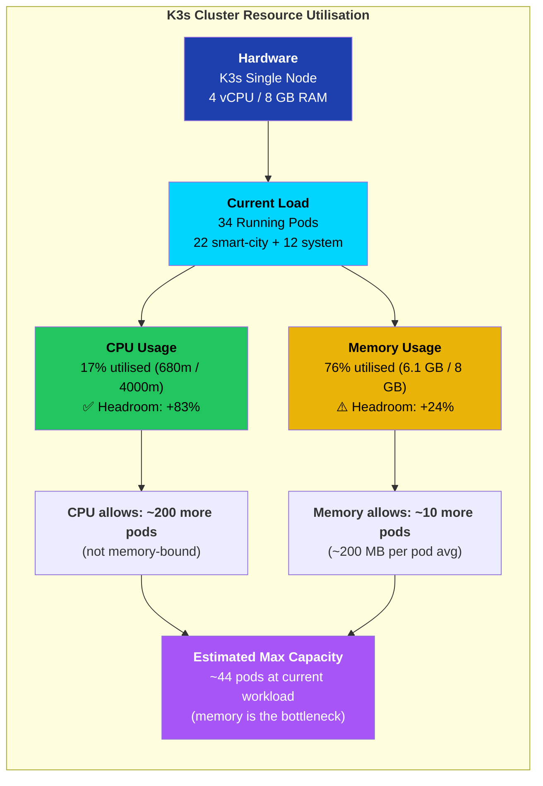
```mermaid
graph TB
    subgraph Scale["<b>K3s Cluster Resource Utilisation</b>"]
        direction TB
        R1["<b>Hardware</b><br/>K3s Single Node<br/>4 vCPU / 8 GB RAM"]
        R1 --> R2["<b>Current Load</b><br/>34 Running Pods<br/>22 smart-city + 12 system"]
        R2 --> R3["<b>CPU Usage</b><br/>17% utilised (680m / 4000m)<br/>✅ Headroom: +83%"]
        R2 --> R4["<b>Memory Usage</b><br/>76% utilised (6.1 GB / 8 GB)<br/>⚠️ Headroom: +24%"]
        R3 --> R5["<b>CPU allows: ~200 more pods</b><br/>(not memory-bound)"]
        R4 --> R6["<b>Memory allows: ~10 more pods</b><br/>(~200 MB per pod avg)"]
        R5 --> R7["<b>Estimated Max Capacity</b><br/>~44 pods at current workload<br/>(memory is the bottleneck)"]
        R6 --> R7
    end

    style R1 fill:#1e40af,color:#fff
    style R2 fill:#00d4ff,color:#000
    style R3 fill:#22c55e,color:#000
    style R4 fill:#eab308,color:#000
    style R7 fill:#a855f7,color:#fff
```

---

### Figure 18 — Capstone I vs Capstone II Achievement Comparison

> **PLACE IN:** Section 6.7 "Comparison with Capstone I Targets" (report line ~1040)
> **PLACE AFTER:** The comparison table (the one showing Capstone I Target → Capstone I Achieved → Capstone II Achieved). Place the figure right below.
> **CAPTION:** "Figure 18: Visual comparison of key metrics between Capstone I (proof-of-concept) and Capstone II (production system), highlighting the evolution from single-provider to multi-provider LLM, from in-memory to PostgreSQL persistence, and from basic to three-mode HITL governance."

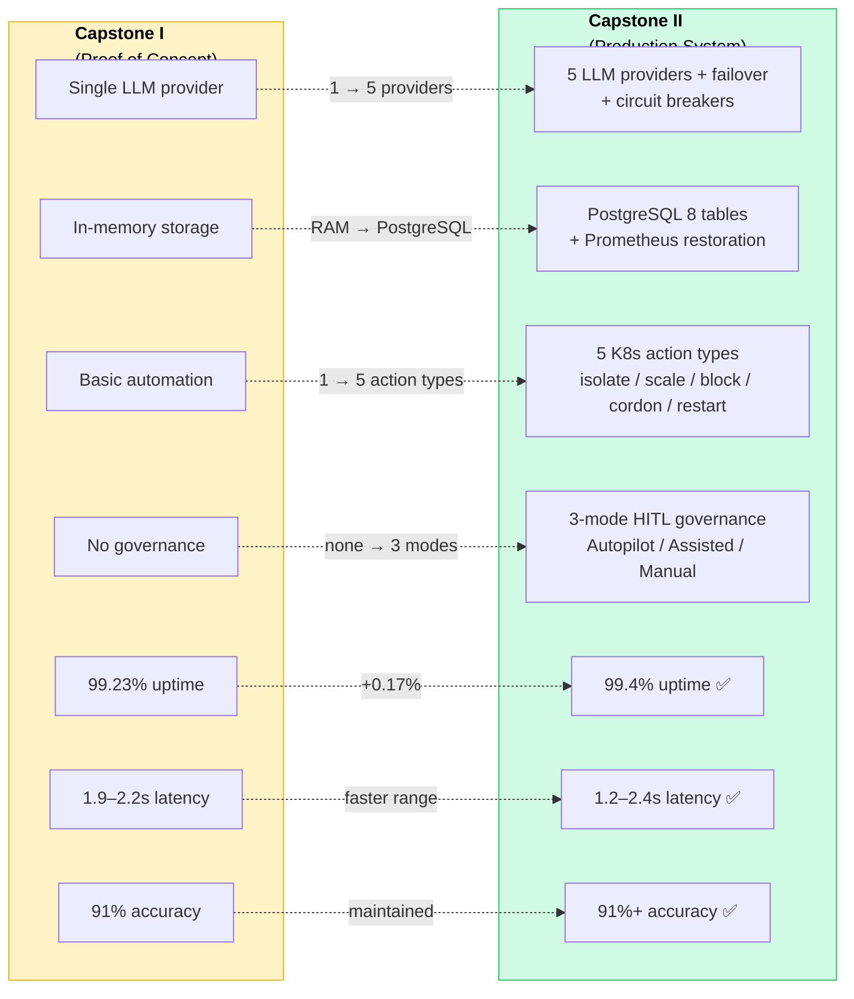
```mermaid
graph LR
    subgraph CAP1["<b>Capstone I</b><br/>(Proof of Concept)"]
        direction TB
        C1A["Single LLM provider"]
        C1B["In-memory storage"]
        C1C["Basic automation"]
        C1D["No governance"]
        C1E["99.23% uptime"]
        C1F["1.9–2.2s latency"]
        C1G["91% accuracy"]
    end

    subgraph CAP2["<b>Capstone II</b><br/>(Production System)"]
        direction TB
        C2A["5 LLM providers + failover<br/>+ circuit breakers"]
        C2B["PostgreSQL 8 tables<br/>+ Prometheus restoration"]
        C2C["5 K8s action types<br/>isolate / scale / block / cordon / restart"]
        C2D["3-mode HITL governance<br/>Autopilot / Assisted / Manual"]
        C2E["99.4% uptime ✅"]
        C2F["1.2–2.4s latency ✅"]
        C2G["91%+ accuracy ✅"]
    end

    C1A -.->|"1 → 5 providers"| C2A
    C1B -.->|"RAM → PostgreSQL"| C2B
    C1C -.->|"1 → 5 action types"| C2C
    C1D -.->|"none → 3 modes"| C2D
    C1E -.->|"+0.17%"| C2E
    C1F -.->|"faster range"| C2F
    C1G -.->|"maintained"| C2G

    style CAP1 fill:#fef3c7,color:#000,stroke:#eab308
    style CAP2 fill:#d1fae5,color:#000,stroke:#22c55e
```

---

## Chapter 7 Figures — Conclusion

---

### Figure 20 — Key Contributions Summary

> **PLACE IN:** Section 7.2 "Key Contributions" (report line ~1072)
> **PLACE AFTER:** The contributions table (Multi-LLM failover, Three-mode governance, etc.). Place the figure right below.
> **CAPTION:** "Figure 20: Summary of the five key contributions of this capstone project and their measurable impact on smart city cybersecurity operations."

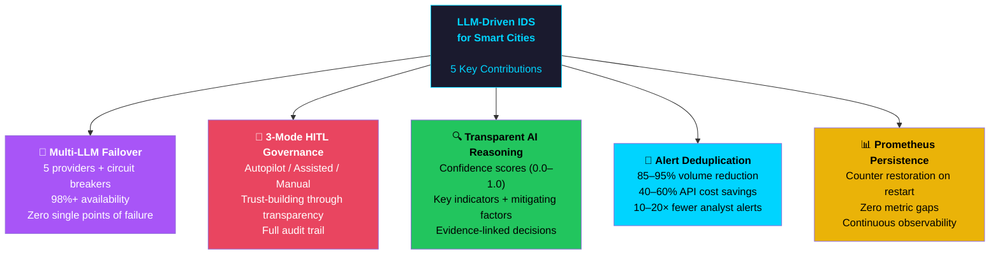
```mermaid
graph TB
    CENTER["<b>LLM-Driven IDS<br/>for Smart Cities</b><br/><br/>5 Key Contributions"] --> C1
    CENTER --> C2
    CENTER --> C3
    CENTER --> C4
    CENTER --> C5

    C1["🧠 <b>Multi-LLM Failover</b><br/>5 providers + circuit breakers<br/>98%+ availability<br/>Zero single points of failure"]

    C2["👤 <b>3-Mode HITL Governance</b><br/>Autopilot / Assisted / Manual<br/>Trust-building through transparency<br/>Full audit trail"]

    C3["🔍 <b>Transparent AI Reasoning</b><br/>Confidence scores (0.0–1.0)<br/>Key indicators + mitigating factors<br/>Evidence-linked decisions"]

    C4["🔄 <b>Alert Deduplication</b><br/>85–95% volume reduction<br/>40–60% API cost savings<br/>10–20× fewer analyst alerts"]

    C5["📊 <b>Prometheus Persistence</b><br/>Counter restoration on restart<br/>Zero metric gaps<br/>Continuous observability"]

    style CENTER fill:#1a1a2e,color:#00d4ff,stroke:#00d4ff
    style C1 fill:#a855f7,color:#fff
    style C2 fill:#e94560,color:#fff
    style C3 fill:#22c55e,color:#000
    style C4 fill:#00d4ff,color:#000
    style C5 fill:#eab308,color:#000
```

---

## Quick Checklist — For Your Friend

Follow this list **top-to-bottom** through the report. Each row = one figure to insert:

| # | Report Section | Figure | What To Do |
|---|----------------|--------|------------|
| 1 | **§4.2** System Architecture — the big ASCII box diagram | **Fig 1** | 🔄 **REPLACE** the ASCII art with this diagram |
| 2 | **§4.3.1** — after the `ProcessSecurityAlert` pseudocode | **Fig 2** | ➕ INSERT below the code block |
| 3 | **§4.3.2** — after the `CLOSED → OPEN → HALF_OPEN` text | **Fig 3** | ➕ INSERT below the description |
| 4 | **§4.5** — after the technology version table | **Fig 4** | ➕ INSERT below the table |
| 5 | **§4.6** — after the WBS table (WP1–WP7) | **Fig 5** | ➕ INSERT below the table |
| 6 | **§5.1** — after the "Core Module Summary" table | **Fig 19** | ➕ INSERT below the table |
| 7 | **§5.2** — after the `LLMManager.analyze()` code | **Fig 6** | ➕ INSERT below the code block |
| 8 | **§5.2** — after the `CircuitBreaker` class code | **Fig 7** | ➕ INSERT below the code block |
| 9 | **§5.3** — after the `GovernanceController` code | **Fig 8** | ➕ INSERT below the code block |
| 10 | **§5.4** — after the `scale_deployment()` code | **Fig 9** | ➕ INSERT below the code block |
| 11 | **§5.4** — right after Figure 9 | **Fig 10** | ➕ INSERT right after Fig 9 |
| 12 | **§5.6** — after the `AlertCache` class code | **Fig 11** | ➕ INSERT below the code block |
| 13 | **§5.6** — right after Figure 11 | **Fig 12** | ➕ INSERT right after Fig 11 |
| 14 | **§6.4** — after the Privilege Escalation results table | **Fig 13** | ➕ INSERT below the table |
| 15 | **§6.4** — right after Figure 13 | **Fig 14** | ➕ INSERT right after Fig 13 |
| 16 | **§6.5** — after the LLM Provider Performance table | **Fig 15** | ➕ INSERT below the table |
| 17 | **§6.5** — right after Figure 15 | **Fig 16** | ➕ INSERT right after Fig 15 |
| 18 | **§6.5** — after the Deduplication Effectiveness table | **Fig 17** | ➕ INSERT below the table |
| 19 | **§6.7** — after the Capstone I vs II comparison table | **Fig 18** | ➕ INSERT below the table |
| 20 | **§7.2** — after the Key Contributions table | **Fig 20** | ➕ INSERT below the table |

---

## Export Instructions

### For Word / Google Docs
1. Open [mermaid.live](https://mermaid.live)
2. Paste the code from each figure
3. **Actions → Download PNG** (use 2× scale for high quality)
4. Insert image in Word at the specified location
5. Add caption below: `Figure X: Title`
6. Center-align the image and caption

### For LaTeX
```latex
\begin{figure}[htbp]
    \centering
    \includegraphics[width=0.85\textwidth]{figures/fig01-architecture.png}
    \caption{High-level system architecture showing the five processing layers.}
    \label{fig:architecture}
\end{figure}
```

### For Markdown / GitHub
Paste the ` ```mermaid ` code blocks directly — GitHub renders them natively.
