# Capstone Report — Figures & Diagrams

> **20 Mermaid diagrams** ready to embed in your capstone report.
> Each figure includes its chapter reference and a Mermaid code block.
> To render: paste each code block into any Mermaid-compatible tool (GitHub Markdown, Mermaid Live Editor, VS Code preview, LaTeX with mermaid-filter, etc.).

---

## Table of Figures

| #  | Title | Report Section |
|----|-------|----------------|
| 1  | High-Level System Architecture | §4.2 System Architecture |
| 2  | Alert Processing Pipeline (Sequence) | §4.3 Algorithm Design |
| 3  | IoT Device Integration Paths | §5.5 IoT Service Design |
| 4  | LLM Multi-Provider Failover Chain | §5.2 Multi-LLM Engine |
| 5  | HITL Governance Modes State Machine | §5.3 Human-in-the-Loop |
| 6  | Kubernetes Cluster Topology | §5.4 Kubernetes Automation |
| 7  | Attack Scenario Severity Distribution | §6.4 Attack Simulation |
| 8  | Alert Volume Reduction Funnel | §5.6 Deduplication Engine |
| 9  | Circuit Breaker State Machine | §5.2 Multi-LLM Engine |
| 10 | Technology Stack Layer Diagram | §4.5 Technology Stack |
| 11 | Project Timeline (Gantt) | §4.6 Work Breakdown Structure |
| 12 | Deduplication Decision Tree | §5.6 Deduplication Engine |
| 13 | Raspberry Pi Network Path | §5.5 IoT Service Design |
| 14 | IoT Device Distribution by Type | §5.5 IoT Service Design |
| 15 | FHIR R4 Resource Hierarchy | §5.5 IoT Service Design |
| 16 | Severity-Based Automated Response Matrix | §5.4 Kubernetes Automation |
| 17 | MITRE ATT&CK for ICS Technique Map | §6.4 Attack Simulation |
| 18 | IoT SDK Integration Steps | §5.5 IoT Service Design |
| 19 | Before vs After: Manual vs AI-Driven Response | §6.5 Performance Metrics |
| 20 | Cluster Scalability & Resource Headroom | §6.5 Performance Metrics |

---

## Chapter 4 — Design & Methodology

### Figure 1 — High-Level System Architecture
**Reference:** §4.2 System Architecture

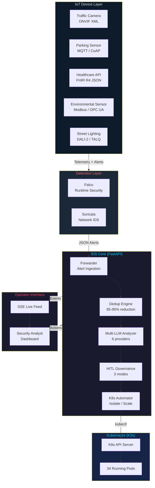

---

### Figure 2 — Alert Processing Pipeline (Sequence Diagram)
**Reference:** §4.3 Algorithm Design

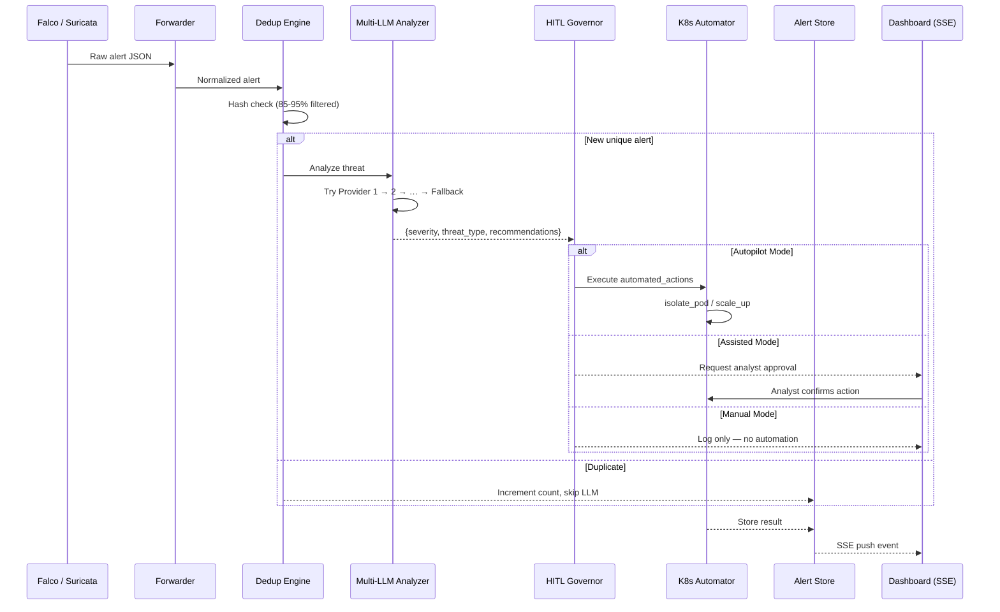

---

### Figure 10 — Technology Stack Layer Diagram
**Reference:** §4.5 Technology Stack

```mermaid
graph TB
    subgraph L8["Layer 8 — Operator Interface"]
        D1["Security Analyst Dashboard\n7 interactive tabs"]
        D2["SSE Live Feed\nReal-time events"]
    end

    subgraph L7["Layer 7 — AI / LLM"]
        A1["xAI Grok-4"]
        A2["OpenAI GPT-4"]
        A3["Anthropic Claude"]
        A4["Google Gemini"]
        A5["Moonshot Kimi"]
        A6["Local Fallback"]
    end

    subgraph L6["Layer 6 — Application"]
        B1["FastAPI IDS Core\nPython 3.11"]
        B2["Dedup Engine"]
        B3["HITL Governance"]
    end

    subgraph L5["Layer 5 — Security"]
        C1["Falco\nRuntime"]
        C2["Suricata\nNetwork"]
    end

    subgraph L4["Layer 4 — Orchestration"]
        E1["K3s (Kubernetes)\nSingle-node cluster"]
    end

    subgraph L3["Layer 3 — IoT Emulation"]
        F1["5 Protocol Emulators\nONVIF, MQTT, FHIR, Modbus, DALI"]
    end

    subgraph L2["Layer 2 — Infrastructure"]
        G1["Ubuntu 24.04 VM\n4 vCPU / 8 GB RAM"]
    end

    subgraph L1["Layer 1 — Hardware Edge"]
        H1["Raspberry Pi 4\nDS18B20 / DHT22"]
    end

    L8 --> L7 --> L6 --> L5 --> L4 --> L3 --> L2 --> L1

    style L8 fill:#e94560,color:#fff
    style L7 fill:#a855f7,color:#fff
    style L6 fill:#00d4ff,color:#000
    style L5 fill:#ef4444,color:#fff
    style L4 fill:#1e40af,color:#fff
    style L3 fill:#22c55e,color:#000
    style L2 fill:#64748b,color:#fff
    style L1 fill:#d97706,color:#000
```

---

### Figure 11 — Project Timeline (Gantt Chart)
**Reference:** §4.6 Work Breakdown Structure

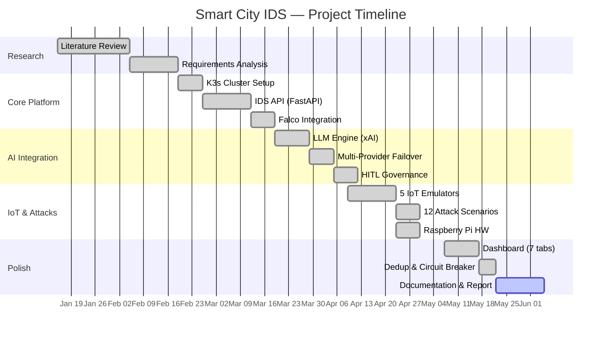

---

## Chapter 5 — Implementation

### Figure 3 — IoT Device Integration Paths
**Reference:** §5.5 IoT Service Design

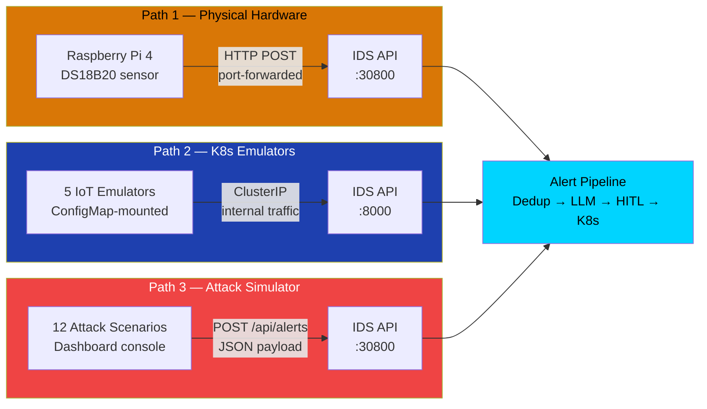

---

### Figure 4 — LLM Multi-Provider Failover Chain
**Reference:** §5.2 Multi-LLM Engine

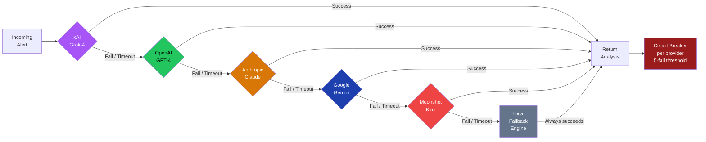

---

### Figure 5 — HITL Governance Modes State Machine
**Reference:** §5.3 Human-in-the-Loop Governance

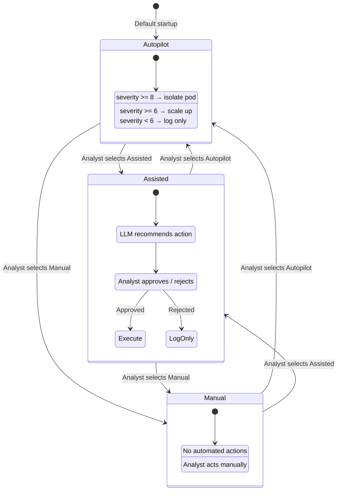

---

### Figure 6 — Kubernetes Cluster Topology
**Reference:** §5.4 Kubernetes Automation

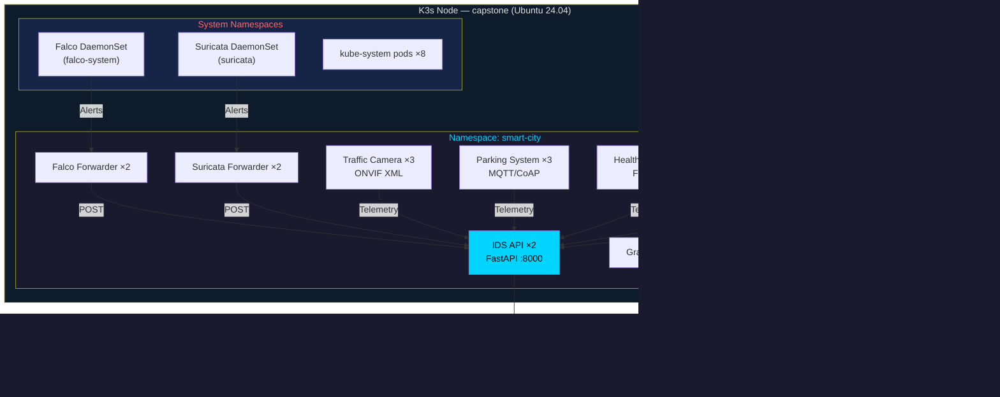

---

### Figure 9 — Circuit Breaker State Machine
**Reference:** §5.2 Multi-LLM Engine

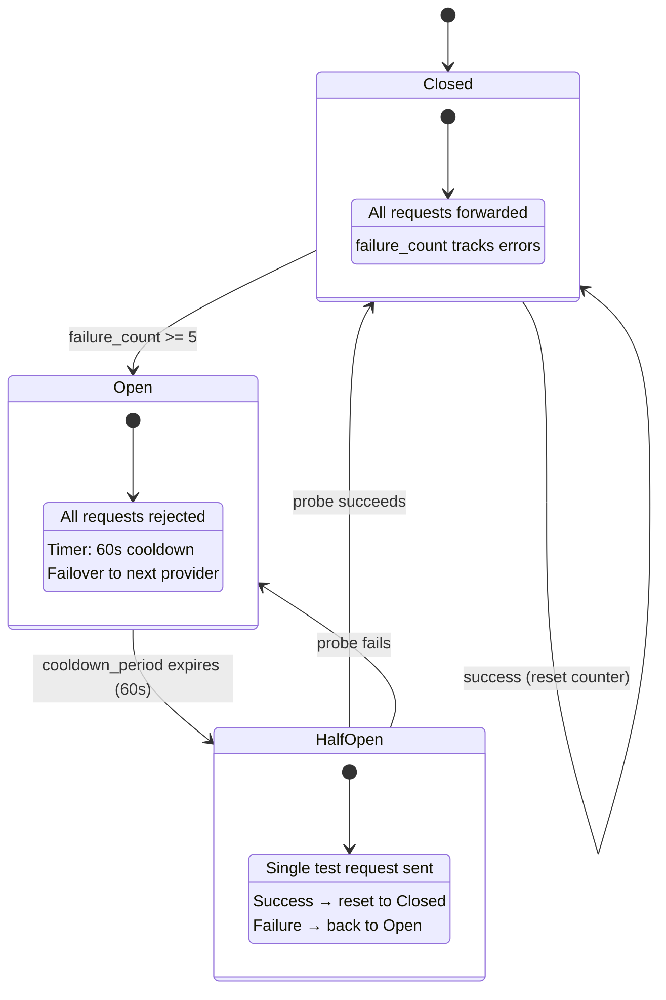

---

### Figure 8 — Alert Volume Reduction Funnel
**Reference:** §5.6 Deduplication Engine

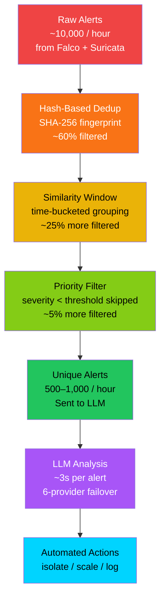

---

### Figure 12 — Deduplication Decision Tree
**Reference:** §5.6 Deduplication Engine

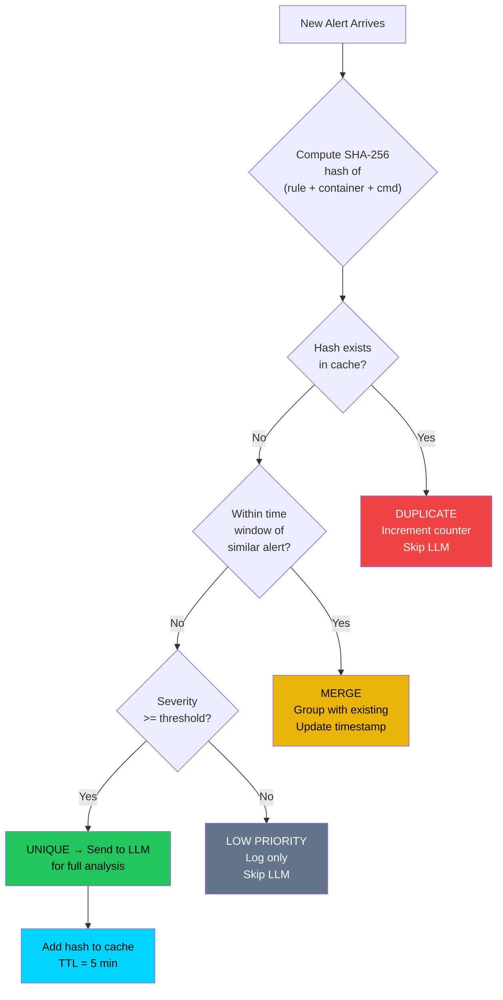

---

### Figure 13 — Raspberry Pi Network Path
**Reference:** §5.5 IoT Service Design

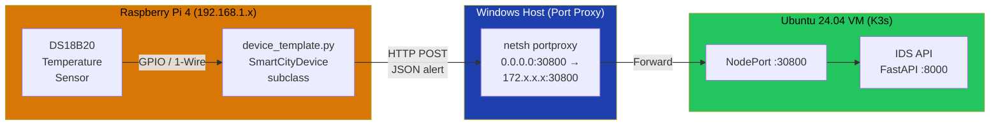

---

### Figure 14 — IoT Device Distribution by Type
**Reference:** §5.5 IoT Service Design

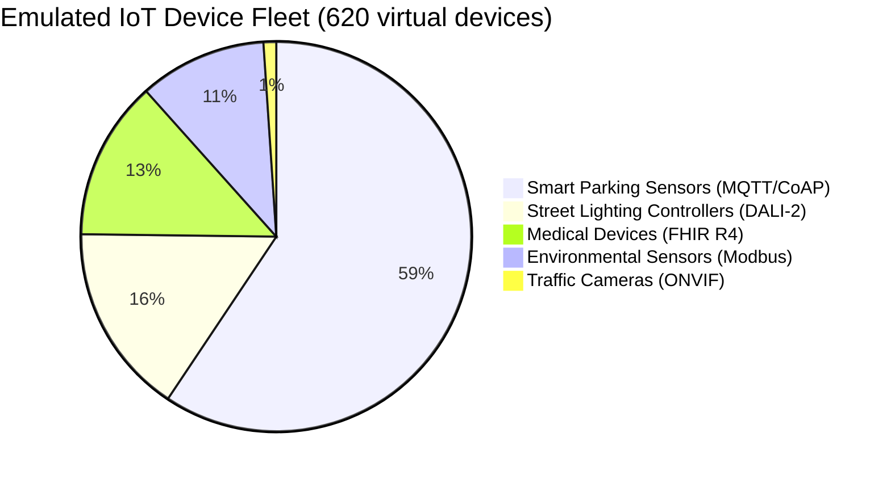

---

### Figure 15 — FHIR R4 Resource Hierarchy
**Reference:** §5.5 IoT Service Design

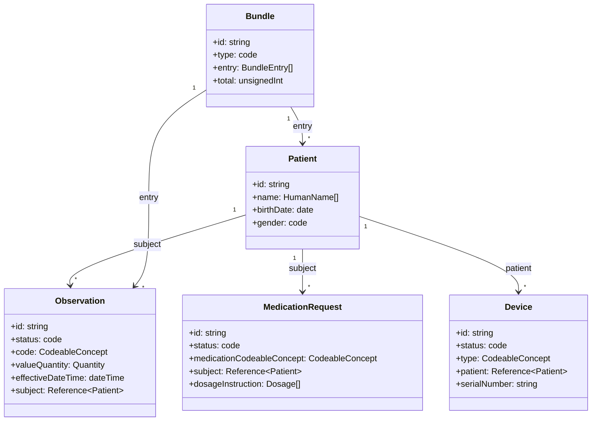

---

### Figure 16 — Severity-Based Automated Response Matrix
**Reference:** §5.4 Kubernetes Automation

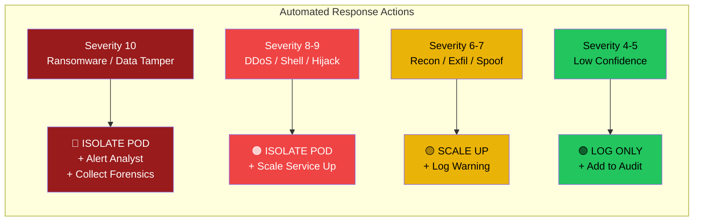

---

### Figure 18 — IoT SDK Integration Steps
**Reference:** §5.5 IoT Service Design

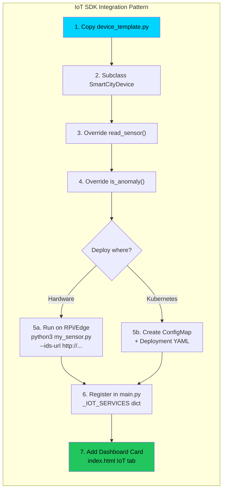

---

## Chapter 6 — Testing & Results

### Figure 7 — Attack Scenario Severity Distribution
**Reference:** §6.4 Attack Simulation

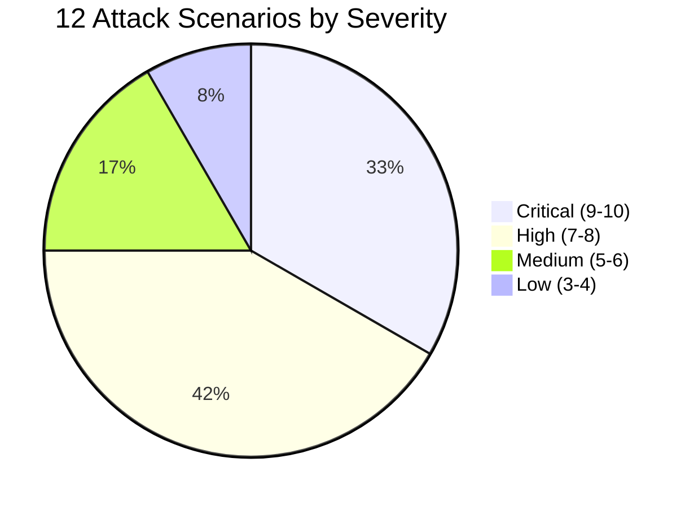

---

### Figure 17 — MITRE ATT&CK for ICS Technique Map
**Reference:** §6.4 Attack Simulation


---

### Figure 19 — Before vs After: Manual vs AI-Driven Response
**Reference:** §6.5 Performance Metrics

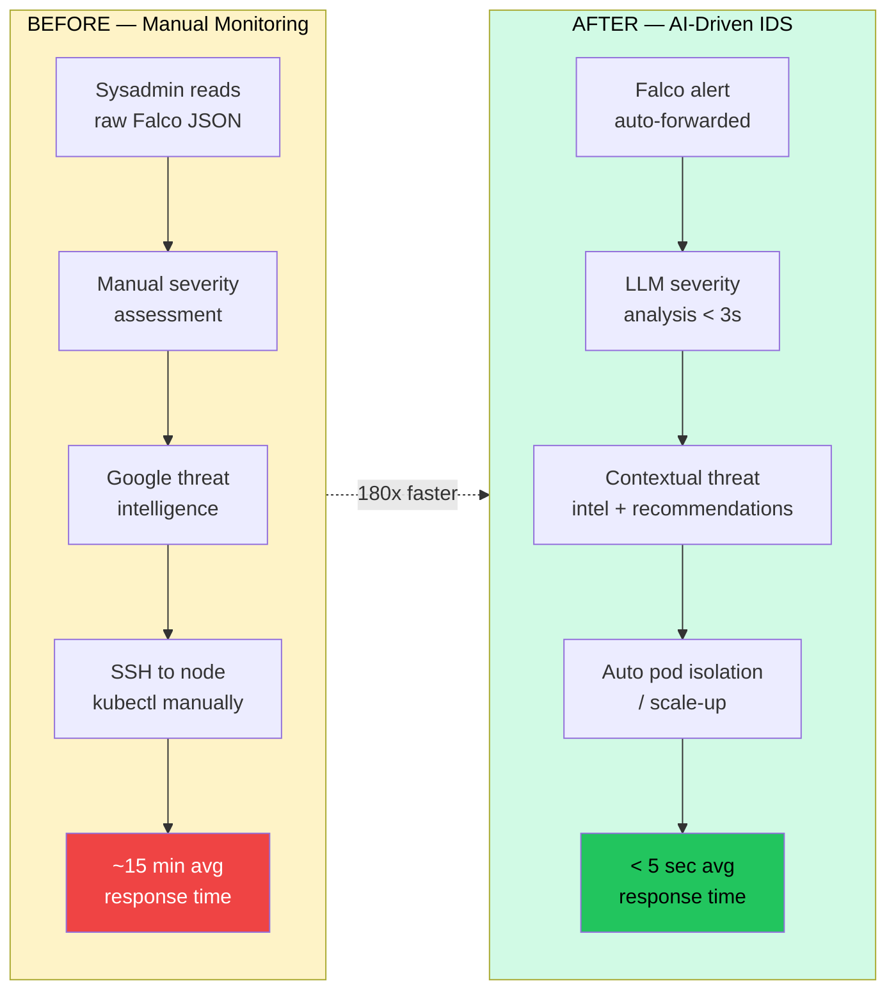

---

### Figure 20 — Cluster Scalability & Resource Headroom
**Reference:** §6.5 Performance Metrics

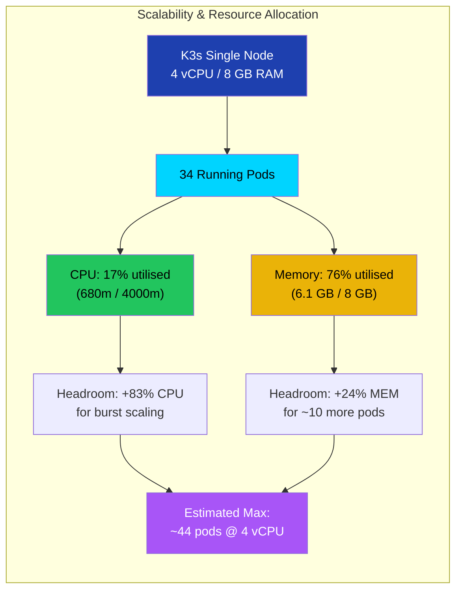

---

## How to Use These Figures

### In Markdown / GitHub
Paste the Mermaid code blocks directly — GitHub renders them natively.

### In LaTeX
Use the [mermaid-filter](https://github.com/raghur/mermaid-filter) Pandoc filter or export each diagram as PNG/SVG from [Mermaid Live Editor](https://mermaid.live) and include with `\includegraphics`.

### In Word / PowerPoint
1. Go to [mermaid.live](https://mermaid.live)
2. Paste the Mermaid code
3. Download as PNG or SVG
4. Insert into your document

### Recommended Captioning
Use IEEE-style captions:
```
Figure X: <Title> — <brief description of what the diagram shows>
```
