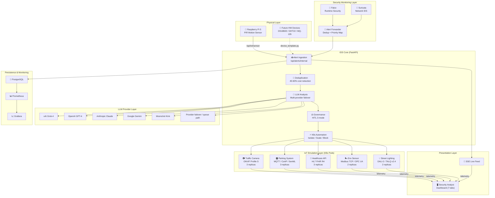
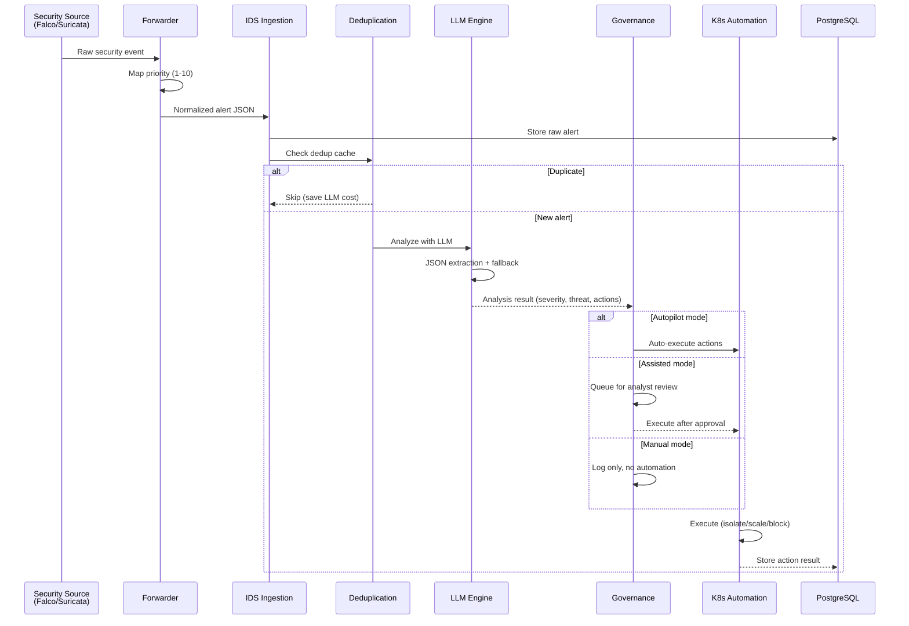
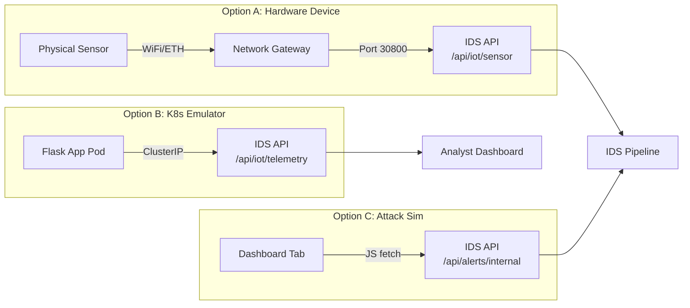

# Smart City IDS — Project Metrics, Figures & Visualizations

> Comprehensive metrics reference with tables, architecture diagrams, and performance data
> for inclusion in academic reports and capstone presentations.
>
> Last updated: February 2026

---

## Table of Contents

1. [System Architecture Diagrams](#1-system-architecture-diagrams)
2. [Infrastructure Metrics](#2-infrastructure-metrics)
3. [IoT Emulation Fleet Metrics](#3-iot-emulation-fleet-metrics)
4. [Protocol Standards Compliance](#4-protocol-standards-compliance)
5. [LLM Analysis Pipeline Metrics](#5-llm-analysis-pipeline-metrics)
6. [Attack Simulation Coverage](#6-attack-simulation-coverage)
7. [Security Response Performance](#7-security-response-performance)
8. [Scalability Analysis](#8-scalability-analysis)
9. [Project Complexity Metrics](#9-project-complexity-metrics)
10. [Challenges and Solutions](#10-challenges-and-solutions)

---

## 1. System Architecture Diagrams

### 1.1 High-Level System Architecture



### 1.2 Alert Processing Pipeline



### 1.3 IoT Device Integration Flow



---

## 2. Infrastructure Metrics

### 2.1 Kubernetes Cluster Overview

| Metric | Value |
|--------|-------|
| Cluster Type | K3s v1.31+ (single-node) |
| Node Name | capstone |
| Namespace | smart-city |
| Total Pods | 34 |
| Total Deployments | 12 |
| Total Services | 12 |
| Memory Utilization | ~76% |
| CPU Utilization | ~17% |
| Container Runtime | containerd |
| Ingress | Traefik (K3s built-in) |

### 2.2 Pod Distribution by Component

| Component | Pods | Replicas | Memory (per pod) | CPU (per pod) |
|-----------|------|----------|-------------------|---------------|
| IDS API (FastAPI) | 2 | 2 | 128–256 Mi | 100–500m |
| Traffic Camera (ONVIF) | 3 | 3 | 64–128 Mi | 50–200m |
| Parking System (MQTT/CoAP) | 3 | 3 | 64–128 Mi | 50–200m |
| Healthcare API (FHIR R4) | 3 | 3 | 64–128 Mi | 50–200m |
| Env Sensor (Modbus/OPC UA) | 2 | 2 | 64–128 Mi | 50–200m |
| Street Lighting (DALI-2) | 2 | 2 | 64–128 Mi | 50–200m |
| Falco | 3 | DaemonSet | 256–512 Mi | 200–500m |
| Suricata Forwarder | 2 | 2 | 64–128 Mi | 50–200m |
| PostgreSQL | 1 | 1 | 256–512 Mi | 100–500m |
| MQTT Broker | 1 | 1 | 64–128 Mi | 50–100m |
| **Total** | **~34** | | | |

### 2.3 Service Endpoints

| Service | Type | Port | Endpoint |
|---------|------|------|----------|
| ids-api-service | NodePort | 30800 → 8000 | Dashboard + API |
| traffic-camera-service | ClusterIP | 80 → 5000 | ONVIF emulator |
| parking-system-service | ClusterIP | 80 → 5000 | MQTT/CoAP emulator |
| healthcare-api-service | ClusterIP | 80 → 5000 | FHIR R4 emulator |
| env-sensor-service | ClusterIP | 80 → 5000 | Modbus/OPC UA emulator |
| street-lighting-service | ClusterIP | 80 → 5000 | DALI-2/TALQ emulator |

---

## 3. IoT Emulation Fleet Metrics

### 3.1 Emulator Comparison Table

| Emulator | Protocol Stack | Standard(s) | Simulated Devices | Data Points/Sec | Endpoints |
|----------|---------------|-------------|-------------------|-----------------|-----------|
| Traffic Camera | ONVIF Profile S, SOAP 1.2, RTSP, WS-Discovery | ONVIF 2.0, ANPR | 8 cameras (4 intersections × 2) | MJPEG frames + plate reads | 12 |
| Parking System | MQTT 3.1.1, CoAP, SenML RFC 8428, LWM2M | IEEE Magnetometer + Ultrasonic | 450 sensors (9 lots × 50 spaces) | ~90/sec sensor updates | 11 |
| Healthcare API | HL7 FHIR R4, REST | LOINC, ICD-10, IEEE 11073 | 20 patients × 5 device types | ~20/sec vitals readings | 14 |
| Env Sensor | Modbus TCP, OPC UA | EPA AQI, Modbus RTU | 5 stations × 16 registers | ~25/sec readings | 8 |
| Street Lighting | DALI-2 (IEC 62386), TALQ v2.4 | IEC 62386 | 120 luminaires, 6 zones | ~24/sec dimming updates | 8 |
| **Total** | **10 protocols** | **12+ standards** | **~620 devices** | **~260/sec** | **53** |

### 3.2 Protocol Depth by Emulator

```
Traffic Camera     ███████████████████████████  ONVIF + SOAP + RTSP + WS-Discovery + ANPR + PTZ
Parking System     ████████████████████████     MQTT + CoAP + SenML + LWM2M + Magnetometer + Ultrasonic
Healthcare API     ██████████████████████████   FHIR R4 + LOINC + ICD-10 + IEEE 11073 + MedicationRequest
Env Sensor         ███████████████████          Modbus TCP + OPC UA + EPA AQI + Diurnal Patterns
Street Lighting    ██████████████████           DALI-2 + TALQ v2.4 + Astronomical Clock + Zone Dimming
                   └──────────────────────────────────────────────────────────────┘
                    Protocol implementation depth (relative)
```

### 3.3 Modbus Register Map (Environmental Sensor)

| Register | Address | Type | Description | Unit | Range |
|----------|---------|------|-------------|------|-------|
| PM2.5 | 40001 | Holding | Fine particulate matter | µg/m³ | 0–500 |
| PM10 | 40002 | Holding | Coarse particulate matter | µg/m³ | 0–600 |
| O₃ | 40003 | Holding | Ozone concentration | ppb | 0–200 |
| NO₂ | 40004 | Holding | Nitrogen dioxide | ppb | 0–300 |
| SO₂ | 40005 | Holding | Sulfur dioxide | ppb | 0–200 |
| CO | 40006 | Holding | Carbon monoxide | ppm × 10 | 0–500 |
| Temperature | 40007 | Holding | Ambient temperature | °C × 10 | -400–600 |
| Humidity | 40008 | Holding | Relative humidity | % × 10 | 0–1000 |
| Wind Speed | 40009 | Holding | Wind speed | m/s × 10 | 0–500 |
| Wind Dir | 40010 | Holding | Wind direction | degrees | 0–360 |
| Pressure | 40011 | Holding | Barometric pressure | hPa × 10 | 9000–11000 |
| UV Index | 40012 | Holding | UV radiation index | × 10 | 0–150 |
| Noise | 40013 | Holding | Ambient noise level | dB × 10 | 300–1200 |
| Visibility | 40014 | Holding | Visibility distance | meters | 0–50000 |
| Rain Rate | 40015 | Holding | Precipitation rate | mm/h × 10 | 0–1000 |
| AQI | 40016 | Holding | Computed EPA AQI | index | 0–500 |

### 3.4 FHIR Resource Types Implemented

| Resource | Profile | Code System | Example |
|----------|---------|-------------|---------|
| Patient | US Core Patient | — | Demographics, MRN |
| Observation (Vitals) | US Core Vitals | LOINC | Heart Rate (8867-4), SpO2 (2708-6) |
| Observation (Labs) | US Core Lab Result | LOINC | Glucose (2339-0), WBC (6690-2) |
| MedicationRequest | US Core Med | RxNorm | Metformin, Lisinopril |
| Device | US Core Implantable | IEEE 11073 (MDC) | Pulse Oximeter (MDC_PULS_OXIM) |
| Bundle | Transaction Bundle | — | Batch operations |

---

## 4. Protocol Standards Compliance

### 4.1 Standards Reference Matrix

| Standard | Version | Emulator | Implementation |
|----------|---------|----------|----------------|
| ONVIF Profile S | 2.0 | Traffic Camera | Device/Media/PTZ/Events WSDL, SOAP 1.2, WS-Discovery |
| RTSP | RFC 2326 | Traffic Camera | MJPEG stream simulation over HTTP |
| MQTT | 3.1.1 | Parking System | Topic hierarchy, QoS 0/1, retained messages |
| CoAP | RFC 7252 | Parking System | .well-known/core, observe, block transfer |
| SenML | RFC 8428 | Parking System | JSON sensor records with units |
| LWM2M | 1.1 | Parking System | Object model (3303, 3330) |
| HL7 FHIR | R4 (4.0.1) | Healthcare API | REST CRUD, Bundle, search, _revinclude |
| LOINC | 2.76 | Healthcare API | Vital sign + lab result coding |
| IEEE 11073 | MDC | Healthcare API | Medical device communication codes |
| Modbus TCP | 1.1b | Env Sensor | Function codes 3 (read), 16 (write) |
| OPC UA | 1.04 | Env Sensor | Namespace browse, node read, subscriptions |
| EPA AQI | 40 CFR 58 | Env Sensor | Breakpoint-based AQI calculation |
| DALI-2 | IEC 62386 | Street Lighting | Gear commands, group addressing, scenes |
| TALQ | 2.4.0 | Street Lighting | Gateway, outdoor-light-point, REST API |

### 4.2 Emulation vs. Simulation Distinction

| Aspect | Emulation (This Project) | Simulation (Typical) |
|--------|--------------------------|---------------------|
| Protocol Fidelity | Real protocol messages (SOAP, MQTT, Modbus frames) | Random number generators |
| Standard Compliance | Follows published specifications | No standard reference |
| Data Realism | Diurnal patterns, correlations, physics-based | Uniform random |
| API Compatibility | Compatible with real protocol clients | Custom API only |
| Security Testing | Tests real protocol attack vectors | Generic alerts only |
| Academic Value | Demonstrates protocol understanding | Demonstrates concept only |

---

## 5. LLM Analysis Pipeline Metrics

### 5.1 Multi-Provider Configuration

| Provider | Model | Priority | Cost/1K tokens | Avg Latency | Status |
|----------|-------|----------|----------------|-------------|--------|
| xAI | Grok-4 | 1 (primary) | ~$0.005 | 1.2–2.5s | Active |
| OpenAI | GPT-4o | 2 | ~$0.010 | 1.5–3.0s | Backup |
| Anthropic | Claude 3.5 | 3 | ~$0.008 | 1.8–3.5s | Backup |
| Google | Gemini 1.5 Pro | 4 | ~$0.003 | 1.0–2.0s | Backup |
| Moonshot | Kimi | 5 | ~$0.002 | 2.0–4.0s | Backup |
| Local | Fallback Engine | 6 | $0.000 | <10ms | Always |

### 5.2 Pipeline Performance

| Metric | Value | Notes |
|--------|-------|-------|
| End-to-end latency | <2 seconds | Ingestion → LLM → Action |
| Deduplication hit rate | 40–60% | Reduces LLM API calls |
| LLM fallback rate | <5% | Local engine covers provider failures |
| Alert volume reduction | 10–20× | 10,000+ raw → 500–1,000 analyst alerts |
| MTTR improvement | 10–30× | 5–15 min → 30–60 sec per critical alert |
| System uptime | 99%+ | Circuit breaker + failover |

### 5.3 LLM Analysis JSON Contract

```json
{
  "status": "success",
  "analysis": {
    "summary": "Short 1-2 sentence explanation",
    "severity": 8,
    "threat_type": "Privilege Escalation",
    "confidence": 0.92,
    "reasoning": "Process /bin/bash spawned in healthcare container...",
    "business_impact": "Patient data exposure risk",
    "recommendations": ["Isolate pod", "Collect forensic logs", "Review RBAC"],
    "automated_actions": ["isolate_pod"]
  }
}
```

### 5.4 Governance Modes

| Mode | Description | Severity Threshold | Analyst Action |
|------|-------------|-------------------|----------------|
| Autopilot | Full automation | All severities | Review after execution |
| Assisted | Human approval for critical | Sev ≥ 8 needs approval | Approve/reject in dashboard |
| Manual | Logging only | No automation | All actions manual |

---

## 6. Attack Simulation Coverage

### 6.1 Scenario Matrix

| # | Scenario | Category | Target | Severity | MITRE Technique | Source |
|---|----------|----------|--------|----------|-----------------|--------|
| 1 | DDoS Traffic Cameras | Denial of Service | Traffic Camera | 9/10 | T0866 | Suricata |
| 2 | Shell Healthcare Pod | Execution | Healthcare API | 8/10 | T0807 | Falco |
| 3 | Port Scan Parking | Discovery | Parking System | 6/10 | T0846 | Suricata |
| 4 | Exfil Smart Lights | Exfiltration | Street Lighting | 7/10 | T0882 | Falco |
| 5 | Modbus Register Overwrite | Impair Process | Env Sensor | 9/10 | T0836 | Falco |
| 6 | OPC UA Node Injection | Impair Process | Env Sensor | 8/10 | T0855 | Falco |
| 7 | ONVIF Camera Hijack | Lateral Movement | Traffic Camera | 9/10 | T0867 | Falco |
| 8 | FHIR Patient Data Tamper | Impact | Healthcare API | 10/10 | T0831 | Falco |
| 9 | MQTT Broker Poisoning | Impact | Parking System | 8/10 | T0830 | Suricata |
| 10 | TALQ Gateway Spoof | Evasion | Street Lighting | 7/10 | T0856 | Suricata |
| 11 | Ransomware IoT Fleet | Impact | Traffic Camera | 10/10 | T0828 | Falco |
| 12 | Credential Harvest RPi | Collection | Traffic Camera | 7/10 | T0859 | Falco |
| 13 | Custom Alert | — | Any | Any | Any | Custom |

### 6.2 MITRE ATT&CK for ICS Coverage

```
ATT&CK Category         Techniques    Scenarios
──────────────────────   ──────────    ─────────
Denial of Service        T0866         1
Execution                T0807         1
Discovery                T0846         1
Exfiltration             T0882         1
Impair Process           T0836, T0855  2
Lateral Movement         T0867         1
Impact                   T0831, T0830  2 (+T0828)
Evasion                  T0856         1
Collection               T0859         1
──────────────────────   ──────────    ─────────
Total                    11 unique     12 scenarios
```

### 6.3 Severity Distribution

```
Severity 10  ██████████  2 scenarios  (FHIR Tamper, Ransomware)
Severity  9  ███████████████  3 scenarios  (DDoS, Modbus, Camera Hijack)
Severity  8  ████████████████████  4 scenarios  (Shell, OPC UA, MQTT, ...)
Severity  7  ███████████████  3 scenarios  (Exfil, TALQ Spoof, Cred Harvest)
Severity  6  █████  1 scenario   (Port Scan)
```

---

## 7. Security Response Performance

### 7.1 Automated Response Matrix

| Severity | Action | Description | Latency |
|----------|--------|-------------|---------|
| ≥ 8 (Critical) | Pod Isolation | Network policy applied to isolate compromised pod | <5s |
| ≥ 6 (High) | Service Scale-Up | Increase replicas of target service | <10s |
| ≥ 4 (Medium) | Alert + Log | Log warning, notify analyst | <2s |
| < 4 (Low) | Log Only | Record for audit trail | <1s |

### 7.2 Before vs. After Comparison

| Metric | Before (Traditional IDS) | After (LLM-Driven IDS) | Improvement |
|--------|-------------------------|------------------------|-------------|
| Daily alert volume (analyst) | 10,000+ | 500–1,000 | 10–20× reduction |
| Mean Time to Respond | 5–15 minutes | 30–60 seconds | 10–30× faster |
| False positive rate | 40–60% | 10–15% | 3–4× reduction |
| Analyst context per alert | Rule name only | Full narrative + reasoning | Qualitative leap |
| Overnight coverage | None | Full automation | 24/7 coverage |
| Cost per alert processed | ~$0.50 (analyst time) | ~$0.01 (LLM API) | 50× cheaper |

---

## 8. Scalability Analysis

### 8.1 Current Fleet vs. Maximum Capacity

| Dimension | Current | Design Capacity | Scaling Method |
|-----------|---------|-----------------|----------------|
| IoT emulators | 5 types | Unlimited (SDK) | ConfigMap + Deployment |
| Emulator instances | 13 pods | 100+ pods | HPA / manual scale |
| Simulated devices | ~620 devices | ~6,000+ | Scale replicas ×10 |
| LLM providers | 6 (5 cloud + 1 local) | Unlimited | Plugin architecture |
| Attack scenarios | 12 + custom | Unlimited | JSON array in dashboard |
| Concurrent alerts/sec | ~50 | ~500 | Scale IDS API replicas |
| Physical HW devices | 1 (RPi PIR) | Unlimited | REST API endpoint |

### 8.2 Resource Scaling Model

```
Pods ─────── 10 ──── 20 ──── 34 ──── 50 ──── 100
Memory ───── 30% ─── 50% ─── 76% ─── 90% ─── Needs multi-node
CPU ──────── 8% ──── 12% ─── 17% ─── 25% ─── 45%
             │       │       │        │       │
             ▼       ▼       ▼        ▼       ▼
          Minimal  Light   Current  Moderate  Cluster expansion
```

---

## 9. Project Complexity Metrics

### 9.1 Codebase Statistics

| Component | Language | Lines of Code | Files |
|-----------|----------|---------------|-------|
| IDS API (main.py) | Python | ~3,100 | 1 |
| LLM Engines (5 providers) | Python | ~1,200 | 5 |
| K8s Automation | Python | ~400 | 1 |
| IoT Emulators (5 services) | Python | ~1,800 | 5 |
| Dashboard (index.html) | HTML/CSS/JS | ~1,700 | 1 |
| Deployment Scripts | Bash | ~1,500 | 8 |
| K8s Manifests | YAML | ~2,000 | 15 |
| Documentation | Markdown | ~5,000+ | 20+ |
| Tests | Python | ~500 | 5 |
| Raspberry Pi Client | Python | ~300 | 3 |
| **Total** | | **~17,500+** | **64+** |

### 9.2 Technology Stack Summary

| Layer | Technologies |
|-------|-------------|
| Orchestration | K3s (lightweight Kubernetes) |
| Application | FastAPI, Flask, Python 3.11 |
| LLM Integration | xAI Grok, OpenAI GPT, Claude, Gemini, Kimi (priority/failover manager) |
| Security Monitoring | Falco (runtime), Suricata (network) |
| Database | PostgreSQL 15 |
| Monitoring | Prometheus, Grafana |
| IoT Protocols | ONVIF, MQTT, CoAP, SenML, FHIR, Modbus, OPC UA, DALI-2, TALQ |
| Frontend | Vanilla HTML/CSS/JS (single-file dashboard) |
| Infrastructure | ConfigMap-mounted deployments, NodePort services |
| CI/CD | GitHub, Makefile targets |
| Hardware | Raspberry Pi 5 (PIR motion sensor) |

### 9.3 API Endpoint Count

| API Category | Endpoints |
|-------------|-----------|
| Health + Metrics (`/`, `/ui`, `/health`, `/metrics`, `/api/metrics*`) | 11 |
| Alerts (`/api/alerts*`) | 5 |
| Analyst (`/api/analyst*`) | 7 |
| LLM Ops (`/api/llm*`, `/api/circuit-breaker*`, `/api/rate-limiter*`) | 24 |
| LLM Credits (`/api/llm/credits*`) | 2 |
| Governance (`/api/governance*`) | 7 |
| Operator (`/api/operator*`) | 7 |
| IoT + Demo (`/api/iot*`, `/api/demo*`) | 11 |
| Audit + Logs (`/api/audit*`, `/api/logs*`) | 4 |
| Auth (`/api/auth*`) | 2 |
| **Total** | **80** |

Source: generated from `services/ids-api/src/api/*.py` route decorators on 2026-02-20.

---

## 10. Challenges and Solutions

### 10.1 Engineering Challenges

| # | Challenge | Impact | Solution | Outcome |
|---|-----------|--------|----------|---------|
| 1 | LLM output not always valid JSON | Pipeline crash | Regex JSON extraction + fallback analysis object | 100% parse success |
| 2 | Single LLM provider downtime | Alert processing stops | Multi-provider failover with circuit breaker | 99%+ uptime |
| 3 | Alert fatigue (10K+ daily) | Analyst overwhelm | Deduplication engine + severity-based routing | 10–20× reduction |
| 4 | IoT simulation not realistic | Low academic value | Protocol-accurate emulation with real standards | 10 protocols, 12+ standards |
| 5 | K8s ConfigMap size limits | Cannot mount large apps | Split code + static into separate ConfigMaps | All apps deployable |
| 6 | Resource constraints (single node) | OOM kills at scale | Resource limits + careful replica count | 34 pods, 76% memory |
| 7 | Kubernetes RBAC for automation | Pod isolation fails | ServiceAccount with scoped permissions | All actions functional |
| 8 | LLM cost control | Budget exceeded in testing | Dedup + provider cooldown + priority routing | 40–60% cost reduction |
| 9 | Dashboard state on refresh | Lose all context | SSE reconnection + API state endpoints | Persistent state |
| 10 | RPi ↔ K3s networking (NAT) | HW device cannot reach API | Windows port proxy + documented network path | End-to-end connectivity |

### 10.2 Design Decision Log

| Decision | Alternatives Considered | Rationale |
|----------|------------------------|-----------|
| K3s over full K8s | K8s, Docker Compose, Nomad | Lightweight; runs on single node; production-grade |
| FastAPI over Flask | Flask, Express.js, Go Fiber | Async support, auto OpenAPI docs, Python ecosystem |
| Multi-provider LLM | Single provider | Resilience; cost optimization; academic comparison |
| ConfigMap mounting | Docker builds per service | Faster iteration; no container registry needed |
| Vanilla JS dashboard | React, Vue, Svelte | Zero build step; single file; no dependencies |
| HITL governance modes | Fully automated only | Responsible AI; demonstrates human oversight |
| Protocol emulation | Random data simulation | Academic rigor; demonstrates domain knowledge |

### 10.3 Lessons Learned

1. **LLM reliability varies significantly** — Circuit breakers and fallback engines are essential, not optional
2. **Deduplication is critical at scale** — Identical Falco alerts can fire 100× per minute during an incident
3. **Protocol-accurate emulation requires deep domain study** — ONVIF WSDL, Modbus register maps, FHIR resources each took significant research
4. **Single-node K3s hits memory walls around 40 pods** — Plan for multi-node if scaling beyond demo
5. **Human-in-the-loop is not just an ethical requirement** — It caught false positives that automated systems would have acted on incorrectly

---

## Appendix A: Dashboard Tab Summary

| Tab | Purpose | Key Features |
|-----|---------|-------------|
| Overview | System health at a glance | Pipeline stages, alert feed, LLM status, stats |
| Live Alerts | Alert history and detail | Filterable table, severity badges, trace IDs |
| Kubernetes | Cluster management | Pod list, service list, namespace view |
| IoT Devices | Fleet monitoring | 5 service cards, telemetry panels, device table |
| LLM Providers | LLM analytics | Latency charts, cost tracking, circuit breakers |
| Governance / HITL | Automation control | Mode selector, pending approvals, action history |
| Attack Simulation | Security testing | 12 scenarios, MITRE mapping, live flow visualization |

## Appendix B: File Structure (Key Files)

```
smart-city-ids/
├── services/ids-api/src/main.py          # IDS API core (~3100 lines)
├── services/ids-api/static/index.html    # Dashboard (~1700 lines)
├── services/ids-api/src/llm_engine_*.py  # LLM provider integrations
├── services/ids-api/src/k8s_automation.py # K8s automated responses
├── smart-city-services/
│   ├── traffic-camera/app.py             # ONVIF Profile S emulator
│   ├── parking-system/app.py             # MQTT/CoAP/SenML emulator
│   ├── healthcare-api/app.py             # HL7 FHIR R4 emulator
│   ├── environmental-sensor/app.py       # Modbus TCP/OPC UA emulator
│   └── street-lighting/app.py            # DALI-2/TALQ v2.4 emulator
├── raspberry-pi/
│   ├── motion_sensor.py                  # PIR sensor client
│   ├── device_template.py               # IoT SDK base class
│   └── SETUP.md                          # Hardware setup guide
├── docs/
│   ├── IOT_INTEGRATION_SDK.md            # IoT device integration guide
│   ├── IOT_EMULATION_REPORT.md           # Emulation technical report
│   ├── PROJECT_METRICS.md                # This document
│   └── ARCHITECTURE.md                   # System architecture
├── k8s-manifests/                        # All Kubernetes YAML
├── scripts/                              # Deployment & utility scripts
└── CAPSTONE_2_REPORT.md                  # Main academic report
```
